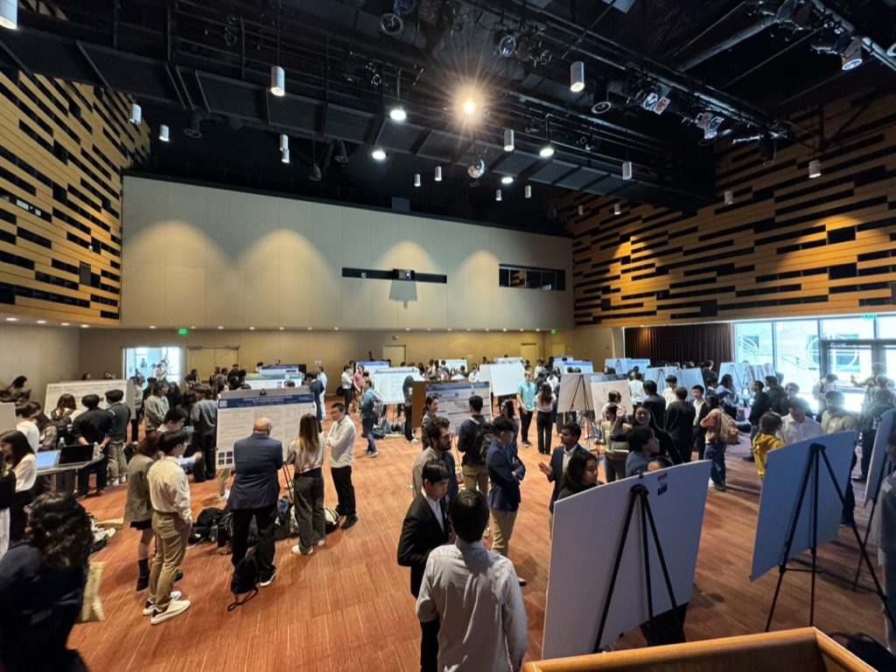

# {{ page.title }}
{: .mb-2 }
{{ site.description }}
{: .fs-6 .fw-300 }

Eventually, this page will point to the student-facing course website for the 2024-25 offering of the DSC capstone. For now, we'll point to several important pages of general interest.

Here, "last year" refers to the 2023-24 academic year.

**For everyone**:
- Last year's [final project submissions](https://dsc-capstone.org/showcase-24).
- Last year's [domain descriptions and enrollment page](https://dsc-capstone.org/enrollment).

**For students**:

- Last year's [course website](https://dsc-capstone.org/2023-24). Specific subpages:
    - The [syllabus](https://dsc-capstone.org/2023-24/syllabus).
    - The [Quarter 2 Project specifications](https://dsc-capstone.org/2023-24/assignments/projects/q2).

**For mentors**:

- Last year's [mentor guide](https://dsc-capstone.org/2023-24/mentors).

 The 2023-24 capstone showcase was held on March 15th, 2024.
