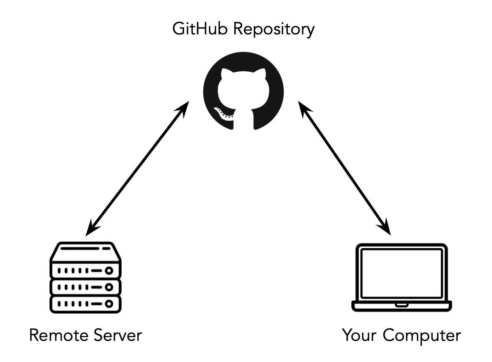

# Lesson 1 – Servers
{:.no_toc}

All lectures will be delivered as readings that you complete on your own time. Post questions with the lesson [here](https://edstem.org/us/courses/28947/discussion/1834296).

Make sure to read this article before moving on to [Methodology Assignment 1](../../../assignments/methodology/q1/01).

---

## Table of contents
{: .no_toc .text-delta }

1. TOC
{:toc}

---

## Local Development vs. Remote Development

### Introduction

In your coursework so far, the majority of the projects you've worked on were likely small enough in scale that you were able to run them entirely locally, i.e. on your personal computer. However, as your projects grow in scale and complexity, and your datasets grow in size, you will need to start resorting to more powerful **servers** to perform your computation. You will access servers **remotely** through your personal computer.

Servers are great, as they give you access to RAM, CPU, and GPU resources that far exceed those of your personal computer. In addition, it's possible to let your code run on a server for days or weeks if necessary, which would be wildly inconvenient to do on your personal computer (imagine not letting your laptop go to sleep for a whole week 😴).

However, just because you have access to a server doesn't mean you won't need to write or run anything on your personal computer. After all, it's far more convenient to run code on your personal computer than it is on a server, in part because your personal computer likely already has all of the packages it needs to run your project.

So then, when should you run code on your personal computer vs. on a server?

### Example

Let's suppose you need to train a model on 1 TB of training data. On the server, it will take ~24 hours to run (it would be impossible to train this model on your personal computer – it would take far too long.) How do you go about training your model?

Here's one solution:
1. Get access to a large, expensive, remote GPU cluster and run `train.py` on it.
2. A day later, notice a bug in `train.py`, meaning all outputs are invalid. (This **will** happen to you!)
3. Re-run `train.py`.
4. Repeat steps 2 and 3 until you're satisfied. By the time your code works as intended, weeks will have passed and many dollars will have been spent on computing resources.

It is easy to fall into the trap of following the steps above. In fact, the same scenario can occur when working with a large dataset locally – you've likely re-run a piece of code locally several times and waited minutes for each run, tweaking small things after each run.

There's a better solution:
1. Develop your code locally on a small, representative set of your training data (for instance, a sample of 10,000 rows).
2. Once you're content with your code, push it to GitHub from your personal computer, and pull it on the GPU cluster.
3. Run `train.py` once on the GPU cluster and be happy with the results!

Moral of the story: don't run under-tested code in production.

<center></center>

### Guidelines

In order to run your code both on your personal computer and on a server, here are a few things you'll need to keep in mind:
1. Your code needs to stay up-to-date in both places. As such, make frequent commits when developing your code on your personal computer.
2. Remote servers typically don't have graphical user interfaces, so you'll need to use the command-line (bash), both generally and to interface with GitHub, since GitHub Desktop typically won't be available. (Note that the server that we will use **does** provide access to Jupyter Notebooks and VS Code, as we will see shortly.)
3. **Your code needs to be able to run on both your personal computer and on the server.** This means that you need to have the same versions of programming languages and packages in both places, i.e. that your methods need to be **reproducible**. **Docker** is a tool that will use in a few weeks to solve this issue.

---

## Using the Campus Cluster

### DataHub and DSMLP

You've already used a remote server in your data science classes before – DataHub! DataHub is a campus-hosted server that allows you to run Jupyter Notebooks. In fact, DataHub also allows you to use JupyterLab, a full-fledged IDE that contains a Terminal, a Python console, and a text editor, among other things. (Since there's a Terminal, you can use Git to access your work.)

However, DataHub shuts down after 30 minutes of client inactivity, which makes it impossible to run jobs that require hours to run. In addition, most DataHub configurations only have a small amount of RAM and CPU resources, which won't be sufficient for our purposes. 

As such, **we will not be using DataHub!**

Instead, we will be using UCSD's Data Science and Machine Learning Platform (DSMLP). It turns out that DataHub is run on DSMLP, so in some sense you've already used it. However, **you access DSMLP via the command-line, e.g. the Terminal**. In the next section, we'll look at exactly how to do so.

One of the advantages of learning how to work with DSMLP now is that many of the skills you gain will easily translate to other cloud computing services, like AWS, GCP, and Azure. To be precise, DSMLP is a Kubernetes cluster on which you can run processes in Docker containers; a Docker container is a package that contains everything needed to run an application (e.g. specific code, tools, and libraries), and Kubernetes is a tool that "orchestrates" containers, making sure each one has access to the resources it needs. We'll learn more about both of these tools in the coming weeks.

### Accessing DSMLP

Here, we will cover the basics of accessing DSMLP. For more advanced usage, see [campus documentation](https://support.ucsd.edu/services?id=kb_category&kb_category=368cc80fdb5c68d0d4781c79139619e2), which is very detailed, as well as the [Resources](../../../resources) tab of the course website.

| **Step 1**: Open your Terminal and run `ssh <username>@dsmlp-login.ucsd.edu`, where `<username>` is replaced with your official UCSD username. For instance, Suraj would run `ssh srampure@dsmlp-login.ucsd.edu`. Enter your password when prompted. |

If you did this correctly, you will likely see a message that's something along the lines of

```
Hello srampure, you are currently logged into dsmlp-login.ucsd.edu

You are using 0% CPU on this system
```

Now, you've been placed into an initial "jumpbox" server. Think of this initial server as the lobby of a hotel – you _could_ sleep here, but you probably want an actual room, i.e. an actual server. To specify which actual server we want to use, we need to run a **launch script**.
- There are several default launch scripts that exist, that initialize pre-configured servers with common tools pre-installed (like `pandas` and Jupyter Notebooks). When using a default launch script, there will always be some default amount of RAM, CPU, and GPU resources allocated, but you can provide flags when running the launch script to change these.
- You can also create a custom launch script to initialize a custom environment with your own packages. We will see how to do this later.

| **Step 2**: Now, in the same Terminal window enter `launch-scipy-ml.sh`. |

This will initialize a server with 2 CPUs, 8 GB of RAM, and no GPUS, which are the default settings for this launch script. If we instead wanted to ask for 8 CPUs and 32 GB of RAM, we could have run `launch-scipy-ml.sh -c 8 -m 32`. This is not the only script that exists; for instance, we could have run `launch-scipy-ml-gpu.sh`. See [this page](https://support.ucsd.edu/services?id=kb_article_view&sys_kb_id=899d64931b6c991048e9cae5604bcb6e) for more details.

Once you've run the launch script, you now have access to a computer with the resources mentioned above! Note that the server runs Linux, so all of the command-line commands you use should work on Linux (not necessarily Windows or macOS). See the [Command-Line Cheat Sheet](../../../command-line) for more tips.

<center></center>

**Note:** Both the initial jumpbox server and the server you launched have access to the same file system. If you're curious, run `ls` in the Terminal before launching the full server and after, and you'll see the same set of files.

### Jupyter Notebooks and DSMLP

After running the launch script, you should see a link to a Jupyter Notebook at the very bottom of your Terminal window. For instance:

```
You may access your Jupyter notebook at:  http://dsmlp-login.ucsd.edu:12733/user/srampure/?token=ce5cfea8c9a8892593868b91ddc55b21ff61220989eb17d6ee303c6604609009
```

If you copy the link that you see in your Terminal and try to open it in your web browser, you will likely get an error. To access this Jupyter Notebook, you need to follow one of the following two options.

**Option 1: Port Forwarding (recommended)**

Let's take a closer look at the example link provided above.

```
http://dsmlp-login.ucsd.edu:12733/user/srampure/?token=ce5cfea8c9a8892593868b91ddc55b21ff61220989eb17d6ee303c6604609009
```

Here, there are two components:
- A port, `12733` in this case, which appears right after `dsmlp-login.ucsd.edu:` (your port may be different).
- A token, `ce5cfea8c9a8892593868b91ddc55b21ff61220989eb17d6ee303c6604609009` in this case (your token will be different).

Now, **open a new Terminal window on your personal computer**, without closing the old one. This step is crucial – make sure that the name at the start of your command prompt is your personal computer's name, not your username on the server. In that new Terminal window:

1. Enter the command `ssh -N -L 8889:127.0.0.1:<port> <user>@dsmlp-login.ucsd.edu`.
    - For instance, Suraj might enter `ssh -N -L 8889:127.0.0.1:12733 srampure@dsmlp-login.ucsd.edu`.
2. After entering your password, if you see nothing, you're on the right track. Open `http://localhost:8889/user/<username>/tree/` **on your personal computer**, again with `<username>` replaced with your own username (say, `srampure`) When prompted for a "Password or token", enter the token you just found. You should then be good to go!
    - If you change `tree` to `lab` in the URL, you'll be brought to Jupyter Lab, the latest version of the Jupyter Notebooks interface. Jupyter Lab is an IDE, complete with a Terminal and text editor.
    - If you see an error message saying `channel 2: open failed: connect failed: Connection refused`, you are likely entering the wrong port number or the same port is being used elsewhere on your computer, like in another Terminal window.
3. To disconnect:
    - Stop your Jupyter instance, by either hitting the Quit button in the top-right corner of the Jupyter home page or entering `exit` in the Terminal used to launch the container.
    - Switch to the Terminal that is open on your personal computer (the one where you ran `ssh -N -L ...`) and hit `Ctrl+C` on your keyboard (regardless of your operating system) to kill the port-forwarding process.

**Option 2: Using the Campus VPN**

If you choose to go this route, follow the instructions [here](https://blink.ucsd.edu/technology/network/connections/off-campus/VPN/). Note that there are two versions of the UCSD VPN – one that works just in the web browser and one that works for your entire OS. Use the latter, since you'll be working in the Terminal. (If you have an Apple Silicon Mac, you can follow the Mac instructions listed there, even though they say they're for Intel Macs only.)

### Aside: SSH keys

SSH keys allow you to skip the step of entering a password each time you're accessing DSMLP. Follow the steps [here](https://www.digitalocean.com/community/tutorials/how-to-set-up-ssh-keys-2) to set them up. This only takes 2 minutes, but saves a ton of time, especially if your UCSD password is something long and cryptic.

---

## Video

The following video walks through several of the steps mentioned above. It's not a substitute for reading the rest of the lesson!

<div style="position: relative; padding-bottom: 56.25%; height: 0;"><iframe src="https://www.loom.com/embed/6a868bb44936422b97e4beb05a08e3c7" frameborder="0" webkitallowfullscreen mozallowfullscreen allowfullscreen style="position: absolute; top: 0; left: 0; width: 100%; height: 100%;"></iframe></div>