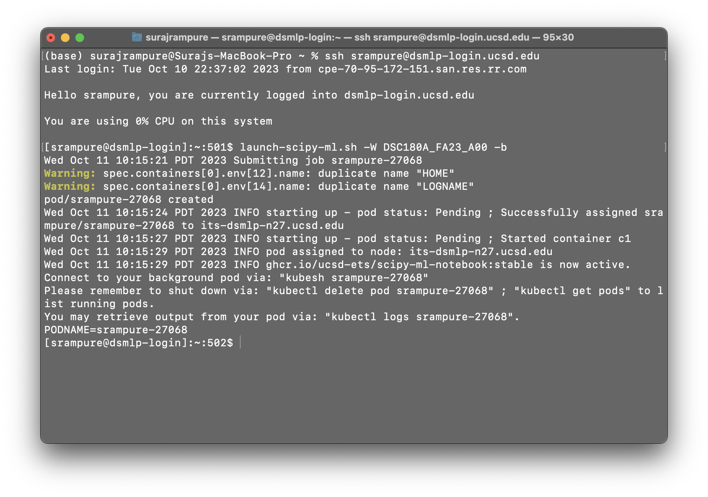

<script type="text/javascript" async
  src="https://cdnjs.cloudflare.com/ajax/libs/mathjax/2.7.7/MathJax.js?config=TeX-MML-AM_CHTML">
</script>

# Lesson 2 – Servers II: GPUs and Background Tasks
{:.no_toc}

All lectures will be delivered as readings that you complete on your own time. This lesson contains two embedded videos; be sure to watch them. Post questions with the lesson [here](https://edstem.org/us/courses/48541/discussion/3619695).

There is no Methodology Assignment associated with this lesson.

---

## Table of contents
{: .no_toc .text-delta }

1. TOC
{:toc}

---

## GPUs on DSMLP

### Recap

In [Lesson 1](../01), you learned how to launch servers on DSMLP. More specifically, what you're launching is a _container_, which you can think of as your own personal computer on the DSMLP servers. Recall, to launch a container, you need to:
1. Log onto the DSMLP jumpbox server.
1. Choose a launch script, e.g. `launch.sh`, `launch-scipy-ml.sh`, or `launch-scipy-ml-gpu.sh`.
1. Use flags to customize the launched container.
  - You'll always use `-W DSC180A_FA23_A00` to tell DSMLP that you're a student in DSC 180A and want to see any DSC 180A-specific data.
  - `-c` and `-m` stand for CPU and RAM, respectively. `-c 8 -m 32` will ask for 8 CPU cores and 32 GB of RAM. (The default for `launch-scipy-ml.sh` is 2 CPU cores and 8 GB of RAM.)
  - `-G list` will show you all teams you're a part of (e.g. A01).
  - `-h` will show you all possible flags.
1. Stitch together the name of the launch script and all desired flags in one line, e.g. `launch-scipy-ml.sh -W DSC180A_FA23_A00 -c 8 -m 32`.

[This page](https://support.ucsd.edu/services?id=kb_article_view&sys_kb_id=899d64931b6c991048e9cae5604bcb6e) of the DSMLP documentation describes several key flags in more detail.

### Requesting GPUs

If you're working in a machine learning-focused domain, you may want to have access to a GPU, or graphics processing unit, for training your models. If you're curious as to why GPUs are so pervasive in modern machine learning, [this Quora answer](https://www.quora.com/Why-are-GPUs-well-suited-to-deep-learning) gives a great overview. An excerpt from it:

> So, in other words, the CPU is good at fetching small amounts of memory quickly (5 * 3 * 7) while the GPU is good at fetching large amounts of memory (Matrix multiplication: (A * B) * C).

DSMLP has several GPUs from NVIDIA available for you to use. By default, DSMLP only allows users to request a single GPU core, which you can do by using the flag `-g 1`. **Make sure to use lowercase `g`, which stands for GPU, not `G`, which stands for group!**
- Often times, using a single GPU core is relatively straightforward, but using multiple cores is much more involved, and beyond the scope of what we'll discuss here. If you'd like to request multiple cores, first note that you'll need to be willing to spend the time to learn how to re-factor your code to use them. (If you're using PyTorch, look into the `nn.parallel.DataParallel` and `nn.parallel.DistributedDataParallel` classes, or look into [HuggingFace Accelerate](https://huggingface.co/docs/accelerate/quicktour).)
- To request multiple cores, you must do so in low priority mode. By using the additional flag `-p low`, you can request up to 8 GPU cores, but note that in low priority mode, if someone else requests the resources you're using, you may be exited from your container. To request 4 GPU cores, for example, you'd use something like `-g 4 -p low`.
- You may have a preference for a certain type of GPU. DSMLP consists of several different nodes, and some nodes have different GPUs than others. To see which nodes have which GPUs and the number of unused GPU cores per node, go to the [DSMLP status page](https://datahub.ucsd.edu/hub/status). You can use the `-n` flag to specify which node you'd like to use. For instance, if you'd like to use node n30, which has a GTX A5000, you can use the flag `-n 30` (not `-n n30`). Note that the status page shows you the number of available cores per node; if the node you'd like has 6 of its 8 GPU cores being used, then you can't request any more than 2 GPU cores if you're asking for that node specifically.
  - If you don't request a specific node, you can see the node you were assigned to in the output that appears when you launch the container. For instance, you may see something like `Wed Oct 11 10:44:35 PDT 2023 INFO pod assigned to node: its-dsmlp-n04.ucsd.edu`, telling you you're in node 4.
  - If you don't request any GPUs, you'll still be in a node that has GPUs, you just won't have access to any of them.
- To just request a specific type of GPU, you can use the `-v` flag, e.g. `-v 1080ti`. The [status page](https://datahub.ucsd.edu/hub/status) has a list of all possible GPU types you could request.

Once you've launched a container, if you're not certain which type of GPU you were given, you can run the following line in your command-prompt:

```
python -c "import torch; print(torch.cuda.get_device_name(0));"
```

Another useful command to be aware of is `nvidia-smi`, which gives you more information about the GPU hardware active on your machine. Learn more about it [here](https://developer.nvidia.com/nvidia-system-management-interface).

### 🎥 Writing GPU-Specific Code

Once you have access to a GPU, you need to enable GPUs in your code. Different machine learning libraries have different ways of doing this. In the following [🎥 video](https://youtu.be/R2wJ4QNYOFo), we recap some of the content from above, and discuss how to enable single-GPU computation in PyTorch. Even if you're not going to use PyTorch in your domain, this is good background knowledge for all data science students to have.

<center>
<iframe width="888" height="500" src="https://www.youtube.com/embed/R2wJ4QNYOFo?si=CMyh3oUqD8wbrLvT" title="YouTube video player" frameborder="0" allow="accelerometer; autoplay; clipboard-write; encrypted-media; gyroscope; picture-in-picture; web-share" allowfullscreen></iframe>
</center>

You can download the notebook used in the video [here](assets/gpu-example.ipynb). It's based on PyTorch's [Deep Learning with PyTorch: A 60 Minute Blitz](https://pytorch.org/tutorials/beginner/deep_learning_60min_blitz.html) series of articles.

### Beyond DSMLP

If your mentor believes that even DSMLP's resources won't be sufficient for your domain's work, it's possible to gain access to AWS through UCSD. Have your mentor reach out to me if this is the case for your domain.

### VSCode and DSMLP

Follow the steps at the bottom of [this page](https://support.ucsd.edu/services?id=kb_article_view&sysparm_article=kb0032269#Setup-VS-Code) of the DSMLP documentation to access DSMLP through VSCode on your personal computer.

---

## Background Tasks

### Overview

Picture this: You're in a Jupyter Notebook, and hit `SHIFT+ENTER` to run a cell. That cell takes minutes, if not hours, to run. Since you can't do anything else in your notebook until the `[*]` symbol vanishes, you use this as an excuse to waste time on TikTok or Reddit. You've likely experienced this before – I know I have.

<center>


</center>

<center><i>In the traditional computing context, it was compiling that took a long time. In your case, it's likely model training.<br>(<a href="https://xkcd.com/303/">source</a>)</i></center>

The reality is, **human time is worth a lot more than compute time**. While we can only work for so many hours a day, servers (like DSMLP) can run 24/7. Here, we'll learn how to initiate jobs that run for hours, or even days, on DSMLP. In order to do this, we need:

- A server that can run even after we log out. As we'll see, we can make DSMLP behave this way. Note that vanilla DataHub doesn't work this way – after 20 minutes of inactivity, DataHub disconnects you. 
- Code that doesn't require human interaction.
  - The job is going to run for minutes or hours without any intervention – we need to be able to run a single command, e.g. a **build script**, that runs our entire workflow. We'll learn more about how to write build scripts in next week's lesson.
- Code that is largely correct.
  - We don't want to wait hours before figuring out that our code is incorrect!
- Good logging.
  - Debugging is more difficult – the outputs of `print` statements won't be captured. In the [Logging](#logging) section, we'll discuss this further.


### DSMLP and Kubernetes

Last week, you learned how to launch servers on DSMLP, and in this lesson above, you learned how to customize the compute resources allocated to your _container_. It turns out that DSMLP is a _Kubernetes cluster_. [Kubernetes](https://kubernetes.io/docs/concepts/overview/) is a platform that manages, or _orchestrates_, containerized workloads. Kubernetes is the system that manages which containers receive which resources on DSMLP.

_Fun fact: [Per the documentation](https://kubernetes.io/docs/concepts/overview/), Kubernetes is often shortened to "K8S" because there are 8 letters between the K and s in Kubernetes._

When we run a launch script on DSMLP, we are requesting a Kubernetes _pod_. While not entirely accurate, it's simplest to think of a pod as another term for a container (this is not fully accurate because pods can consist of multiple containers).

The reason this context is relevant is because we need to interact with the underlying Kubernetes infrastructure in order to initiate a long-running job in a pod. While on the DSMLP jumpbox server, there are two Kubernetes-related command-line tools to know about:
- `kubectl`, which stands for "Kubernetes control", allows us to list and delete pods associated with the current user. (Not sure how it's pronounced? [Neither are the enthusiasts.](https://www.youtube.com/watch?v=2wgAIvXpJqU))
- `kubesh`, which stands for "Kubernetes shell", allows us to connect to the shell (command-line) in a specified pod. 

**To launch a background pod – that is, a pod in which we will initiate a long-running job – we use the `-b` flag when running a launch script.** For instance, we may run `launch-scipy-ml.sh -W DSC180A_FA23_A00 -g 1 -c 4 -b` to create a background-enabled pod with 1 GPU and 4 CPU cores. When using the `-b` flag, notice that we are **not** put into the pod that we requested – instead, the pod is simply created.

<center></center>

<center><i>Note that the hostname is still <code>[srampure@dsmlp-login]</code>!</i></center>

The resulting output contains the pod ID – `srampure-27068` in this case – which we'll need to remember in order to interact with the pod. In order to actually enter the pod, we can run `kubesh <pod-id>`, e.g. `kubesh srampure-27068`.

Once we enter the pod, everything will appear as though we just ran our launch script without the `-b` flag. However, there's a difference – when we exit our pod (by either typing `exit` or hitting `CONTROL+D`), any processes we initiated will keep running!

### 🎥 Running Jobs on Background Pods

For a walkthrough on how to initiate long-running jobs, watch the following [🎥 video](https://youtu.be/2PlR8duAxP0). (It was recorded last year, when the order of methodology content was slightly different – ignore the point about Docker images, and make sure to use `-W DSC180A_FA23_A00`, even though we didn't in the video.)

<center>
<iframe width="888" height="500" src="https://www.youtube.com/embed/2PlR8duAxP0?si=g9hw3qr4NEgnKUh6" title="YouTube video player" frameborder="0" allow="accelerometer; autoplay; clipboard-write; encrypted-media; gyroscope; picture-in-picture; web-share" allowfullscreen></iframe>
</center>

As a summary:
- `kubesh <pod-id>` launches a pod.
- `kubectl get pods` lists all pods.
- `kubectl delete pod <pod-id>` deletes a pod.
- Adding the `&` after a call to `python` in the command-line, e.g. `python run.py test data &`, runs your Python process in the background without taking over the command prompt.
  - `ps` lists all of the current processes and their IDs.
  - `kill <process-id>` kills a process.

Note: The default timeout, according to the [DSMLP documentation](https://support.ucsd.edu/services?id=kb_article_view&sysparm_article=KB0032269&sys_kb_id=5bf581ba872299d4947a0fa8cebb35ea), is 6 hours (not 3, as mentioned in the video). If you need to need a pod to run for up to 12 hours, you can specify this by writing a custom launch script; see [here](https://support.ucsd.edu/services?id=kb_article_view&sysparm_article=KB0032273&sys_kb_id=b18fd328dbe2dcd04cd8f06e0f961988) for instructions on how to do so (you may also want to do this if you've gotten annoyed of writing out several flags each time you want to launch a pod). If you need a pod to run for more than 12 hours, contact datahub@ucsd.edu and mention that it's for DSC 180A.

---

## Logging

When we initiate background tasks, we don't typically have access to the command-line outputs (e.g. print statements) of our code. As such, it can be particularly difficult to debug when and why something went wrong. In this setting, the cost of trial-and-error is high, since each "trial" takes a long time to run.

The solution is to save logs to a file that you can inspect afterwards. The most rudimentary way to do this, if you're already using "print debugging", is to use the `>` keyword when calling `python` from the command-line. For instance,

```
python run.py all > log.txt &
```

will run `run.py` in the background (`&`), with the `test` target, and will save all outputs (e.g. results of print statements, warnings, and error messages) to `log.txt`. While this works, it can be difficult to determine where in the project each line in `log.txt` came from.

A better solution is to use the built-in [`logging`](https://docs.python.org/3/library/logging.html) module. It automatically records a timestamp each time it is called, along with which file and function the logging occurred in. You can customize the granularity and frequency of the logs to match your use case. We won't cover the details of the `logging` module here; instead, we'll point you to [this tutorial by realpython.com](https://realpython.com/python-logging/). However, here is an example of how the module works:

```python
# randdiv.py
import logging
import numpy as np

logging.basicConfig(filename='log.txt', 
		    filemode='a', 
		    level=logging.INFO,
		    datefmt='%H:%M:%S',
		    format='%(asctime)s,%(msecs)d %(name)s %(levelname)s %(message)s')

def myfunc():
    a = np.random.randint(-5, 5)
    b = np.random.randint(-5, 5)

    if b == 0:
        logging.info('zerodivisionerror preempted')

    else:
        return a / b

print([myfunc() for _ in range(100)])
```

Upon running `python randdiv.py`, `log.txt` might contain:

```
2022-10-30 23:37:11,815,815 root INFO zerodivisionerror preempted
```

This tells us when (October 30th at 11:37:11PM) and where (`randdiv.py`, the root-level file in this case) each call to `logging.info` occurred.