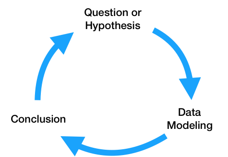
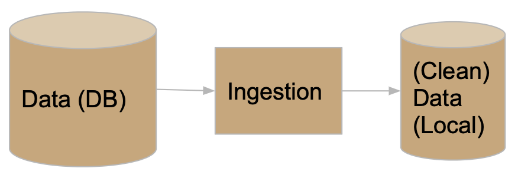
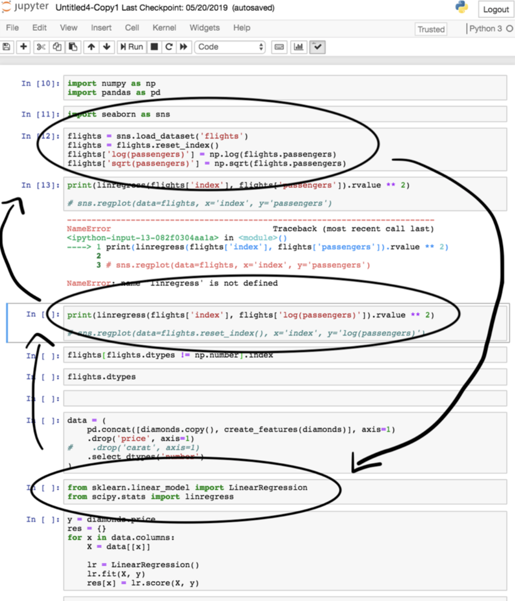

<script type="text/javascript" async
  src="https://cdnjs.cloudflare.com/ajax/libs/mathjax/2.7.7/MathJax.js?config=TeX-MML-AM_CHTML">
</script>

# Lesson 3 – Software Development for Data Science
{:.no_toc}

All lectures will be delivered as readings that you complete on your own time. Post questions with the lesson on Ed.

There is no Methodology Assignment associated with this lesson, but you'll need to follow the principles outlined here when writing the code for your Quarter 1 and Quarter 2 Projects, as **you'll need to be able to justify how your code is structured in order to receive full credit for their code components**.

{: .red }
**Remember, the [Quarter 1 Project Checkpoint](../../../assignments/projects/q1) is due on Monday, November 6th. As part of your checkpoint, you'll need to submit the code you've written so far.**

---

## Table of contents
{: .no_toc .text-delta }

1. TOC
{:toc}

---

## Reproducibility

In this lesson, we'll discuss best practices for writing code for data science projects. In previous years, we attempted to enforce a template that all students had to use, but in practice, it was too restrictive given the variety of projects students were working on (it's hard to come up with a template that works for both students training neural networks and students writing an Android application).

This year, we'll still present you with that template in case you find it useful, but we'll instead focus more on software development **principles**.

{: .green }
The primary asks we have of the code you write in your project is that it is **reproducible**. By reproducible, we mean that anyone should be able to go to your GitHub repository*, read your `README.md` file ([example](#example-readmemd)), and understand exactly how to run your code to recreate your results.

_*You'll have separate repos for your Quarter 1 and Quarter 2 Projects._

The [lack of reproducibility in science](https://en.wikipedia.org/wiki/Replication_crisis), including data science, is a major issue. If nobody else can recreate your results, how do we know that they're valid? The authors of [**Understanding and improving the quality and reproducibility of Jupyter notebooks**](https://link.springer.com/article/10.1007/s10664-021-09961-9) by Pimentel, Murta, Braganholo, and Freire, conducted a study specifically around the reproducibility of work done in Jupyter Notebooks:

> At the same time, there has been growing criticism that the way in which notebooks are being used leads to unexpected behavior, encourages poor coding practices, and makes it hard to reproduce its results. To better understand good and bad practices used in the development of real notebooks, in prior work we studied 1.4 million notebooks from GitHub. We presented a detailed analysis of their characteristics that impact reproducibility, proposed best practices that can improve the reproducibility, and discussed open challenges that require further research and development.

For others to be able to use your project in the future, it needs be:
1. Easily buildable: If it's a hassle to get your project running, then others are unlikely to use it.
2. Flexible: It should be easy for someone else to re-use large pieces of your project while changing just the details that are necessary for their use case.

We'll discuss how to accomplish these goals throughout this lesson. Be warned – it's pretty long. Skim through it now, and come back to it regularly as you start to write and structure your code.

🆕 Another good resource is [**Ten simple rules for writing and sharing computational analyses in Jupyter Notebooks**](https://doi.org/10.1371/journal.pcbi.1007007) by Rule et. al.

---

## Goals

### Overview

At a high level, the **data science lifecycle** looks a lot like the scientific method you saw in elementary school.

<center></center>

While you may begin with a single question, after performing exploratory data analysis and building a model to answer your question, you will likely refine your original question or come up with more questions to investigate. As a result, the code that you write needs to be written so that it can support iteratively changing questions and analyses. Specifically, the code for a data science project needs to be:

1. Flexibly written, to adapt to changing questions.
1. Clearly documented, so that is clear – both to you and others using your code – what each piece does.
1. Reproducible, meaning that others should be able to run it themselves.

In theory, that sounds pretty straightforward. However, as you saw in DSC 80, the real data science lifecycle is anything but.

<a name='DSLC'></a>

<center></center>

This makes it even more crucial that you follow the three principles outlined above. If you're not careful, it's easy to fall in the trap of writing poorly organized code with many hard-coded pieces. This results in:
- Being able to execute fewer iterations of your project, and as a result, making slower progress on your project.
- Being unsure of _what_ your code is even doing, increasing the likelihood of making mistakes while iterating and making it unclear what your conclusions even are.
- Making it less likely that others will be able to use and replicate the results of your project, resulting in your project fading into obscurity.

The purpose of this lesson is to show you how to adhere to the three principles mentioned above, as **this will increase your chances of successfully executing your project**. The contents of this lesson will be relevant for the remainder of the capstone sequence; you will find yourself coming back to it often in the future.

### Managing Project Components

There are a plethora of tools used in industry for managing data science projects, far too many for us to make a dent in them in this course. Instead, we will expose you to a few popular tools that help solve core issues that will be relevant even decades in the future, once the current slate of tools is replaced.

<center>

<br>

<i>A small sample of tools that exist for managing data science projects.</i>

</center>

These core issues revolve around the fact that your project will be made up of several components. For instance, you may have separate components for ingesting and cleaning raw data, creating visualizations, and training models. Issues you need to be aware of are:
- **Communication**: How do these components all communicate with one another? In other words, what are the inputs and outputs of each component? It's important to be clear about what these are up front, to avoid confusion later on.
- **Isolation**: Your code should be written in a way such that each component is as isolated as possible. This way, when you want to make changes to one component – say, loading in another column at the very start of your pipeline – you don't have to make changes to all of your other components. This may happen if you have aspects of your modeling pipeline, like feature names, hard-coded throughout several different files. (It would suck to have to buy a new dashboard for your car every time you get a flat tire – the same principle applies here.)
- **Parallelization and Scale**: It should be clear _when_ each part of your project needs to be run, and whether different parts can be run in parallel. Similarly, it should be clear which components of your project will need to scale as the project grows in scope – for instance, if you collect 10x more data, at what stages will you need more compute resources?

One way we will address all of these issues is through the use of **configuration files**, in which you can specify and track hypotheses and desired outputs. As such, when new questions arise, you won't have to re-write your code; instead, you'll just run it with different configurations.

---

## The Anatomy of a Data Science Project

Let's look at how each component of the [data science lifecycle](#DSLC) interacts with your code. Click below to learn more about each aspect.

<details>
<summary>Domain Research</summary>

<p>The code you write throughout your project will strongly depend on your domain. For instance, suppose you&#39;re working with driver data. In your data cleaning step, you may choose to keep only the drivers whose ages are at least 16, the legal driving age in California. This is a choice you had to make given your knowledge of your domain.</p>
<p>You&#39;ll make several such design decisions while working on your project:</p>
<ul>
<li>You may clean your data in a specific way.</li>
<li>You may choose a particular column as a &quot;target,&quot; and a subset of the remaining columns for features.</li>
<li>You may build certain kinds of models over others.</li>
</ul>
<p>It&#39;s important to document these choices and the context between them. This justification will appear in two places:</p>
<ul>
<li>In your final reports. For instance, in the EDA section of your report, you&#39;d talk about what steps you took to clean your data and why they make sense.</li>
<li>In code comments, whenever relevant. Take the drivers&#39; age example, for instance. In the line where you keep only the drivers who are at least 16, you may add <code># legal driving age</code>.</li>
</ul>


</details>

<a name='qh'></a>

<details><summary>Question / Hypothesis</summary>

<p>You may start with an initial question to investigate, but as your project evolves, so will the questions you&#39;re interested in. To prevent having to re-write your codebase each time you come up with a new question, you should think about how your questions will be similar to one another so that you can <strong>parameterize</strong> your code.</p>
<p>Here&#39;s an example. Suppose you&#39;re looking at traffic stops data, and you&#39;re interested in whether &quot;younger&quot; people (&lt; 30 years old) are stopped at higher rates than &quot;older&quot; people (&gt;= 30 years old). Suppose you&#39;re also interested in answering this question across multiple years – say, for each year from 2016 through 2022 – and across multiple counties in California. The most straightforward approach here is to create functions that take in <code>year</code> and <code>county</code> as input and return just the data needed to look at stop rates for that combination of <code>year</code> and <code>county</code>. Then, in a <strong>configuration</strong> file, you can store all years and counties that you&#39;re interested in. Finally, you can call your data processing and hypothesis testing routines on all combinations of parameters in your configuration file. Note that in this approach, <em>each combination of parameters leads to a different question / hypothesis</em>.</p>
<p>One of the benefits of using configuration files, in addition to keeping your code robust and flexible, is that we can tell a server to run our pipeline for different combinations of parameters on different threads or machines, so that we can conduct our investigations in parallel. For instance, suppose there are 7 years (2016-2022, including both endpoints) and 3 counties (San Diego County, Orange County, and Los Angeles County) that we&#39;re interested in investigating. There are $7 \cdot 3 = 21$ combinations of year and county – wouldn&#39;t it be great if we could run our code for all 21 combinations at the same time?</p>
<p>If some aspect of your question is never going to change, e.g. if you&#39;re always only going to be looking at San Diego County, then it&#39;s fine to hard-code that throughout your codebase. However, it&#39;s generally a good idea to parameterize any aspects of your codebase that <em>could</em> change to keep it adaptable to new questions.</p>
<p>In this course, we will typically store our configuration files in the JSON format, though there are a variety of other possible formats (YAML is popular, as are INI and CFG). You&#39;ll see example configuration files later on in the lesson.</p>

</details>

<details><summary>Data ETL (extract, transform, load)</summary>

<p>As your project evolves, the data that you're working with may also change. For instance, the source where you're pulling traffic stops data from may update daily with the previous day's stop data. You need to make sure that your modeling component doesn't break just because we pulled in a new day's worth of data, or because an additional column was added from the data source. Of course, your code doesn't have to handle <i>all possible data sources</i>, but you should anticipate possible changes and prepare for them.

Here, configuration files will again be useful. For instance, you should explicitly mention which columns you want to use for transformations and model building, so that any new columns that are added in don't impact your model.

You should also think about <i>how</i> you're accessing your data – an API? scraping? found a CSV online? – and <i>where</i> you're storing it. To prevent having to re-pull your data each time your cleaning and transformation logic changes, separate the code you use for data ingestion from the code you use for cleaning and transformation, and store intermediate "raw" data to disk that you can re-use whenever you update your cleaning logic.
</p>

</details>

<details><summary>Model Building</summary>

<p>As you've seen in earlier courses, the model building process is not straightforward – you'll repeatedly try different combinations models and parameters until you feel that your model has sufficient <i>generalizability</i> to unseen data. Continuing with the theme of parametrization, it's a good idea to store all "potential" parameters in configuration files, so that models can be trained and evaulated on different combinations in parallel.</p>

<p>Furthermore, it&#39;s encouraged to use frameworks that enable &quot;pipelining&quot;, like <code>sklearn</code>, which you were exposed to in <a href="https://dsc-courses.github.io/dsc80-2022-sp/resources/lectures/lec23/lec23.html">DSC 80</a>.</p>

</details>

<details><summary>Continued Prediction</summary>

<p>Often times, your project lives on well after you&#39;ve built your &quot;final&quot; model. Your model may be deployed into production to make &quot;live&quot; predictions – for instance, each time you request a ride in the Uber app, it predicts the highest price you&#39;ll pay for a ride. </p>
<p>The <code>model.predict</code> method that you&#39;d use to make predictions in <code>sklearn</code> may actually be called via HTTP requests on a site that uses a Java backend. Once this happens, you may want to keep track of how well your model is performing – are its outputs still reasonable? Is it easy to re-train it to reflect updated data?</p>
<p>The use of pre-trained models, particularly in the case of deep neural networks, is quite popular today. For instance, you can easily use <a href="https://openai.com/api/">OpenAI&#39;s GPT-4</a> language model without having to train it yourself. You should strive to build a model that you can similarly share with others, in the form of a Python package or a Docker container. That way, others can easily use your model to make predictions without having to run your entire pipeline.</p>

</details>

<details><summary>Conclusions and Reports</summary>

<p>The final reports that you create will be written in some sort of markup language, like Markdown, and will explain your results and contain justification for all of the design decisions you made. Your reports will likely involve tables and visualizations that are derived from data. You should try to set up your report such that it automatically generates tables and visualizations using the other components of your project, so that if, say, your data is updated, you can update your report just by re-running your entire pipeline. This, of course, is not possible if your report includes screenshots from other parts of your project; instead, you'll need to programmatically create, save, and load images.</p>

</details>

In short, your projects should be:
- Flexible for quick iterations, through configuration files.
- Understandable through consumers of the output, through documentation and reports.
- Usable for developers and researchers extending your work, through documentation and containerization.

You may wonder how much of this is applicable to you if your project **doesn't involve data analysis**. Indeed, many domains are more methods-focused, where they spend time developing new techniques for collecting or modelling data rather than the entire lifecycle. 

If this is the case, in addition to following general best practices for software development in your domain, **you will still have a data analysis portion in your project**, if only to demonstrate the usage and value of whatever it is you developed. You may have two repositories, one for the software package you develop and one for your "example" analysis (the former of which will be much larger).

---

## An Initial Template

Now that you understand how each step of the data science lifecycle plays a role in your project's structure, let's tangibly look at how you might structure your project. **Note that you are not _required_ to follow this exact structure – more on this in the [Best Practices](#best-practices) section.**

### Configuration vs. Code

Up until now in this lesson, we've repeatedly emphasized the use of configuration files for storing parameters. However, it's not immediately obvious what parts of your pipeline belong in _code_ and what parts belong in _configuration files_.

Code that is used by other processes is called library code, or source code. Your source code may be run in notebooks that you use for EDA and for creating visualizations, and will certainly be run in your final `run.py` file that runs your entire pipeline. Source code will mostly be contained in `.py` files (or `.java` or `.cpp` files, for example). You are already used to using generic functions from libraries like `pandas` and `numpy`; the only difference here is that you are writing these functions yourself.

Configuration files, then, consist of parameters that your source code will use as inputs. For the most part, you will write configuration files in `.json`, but you _could_ also store configurations as global variables at the top of your scripts.

Aim to generalize, but don't overly generalize. It's fine to start writing code with some inputs "hard-coded", e.g. write filtering logic that creates a DataFrame of traffic stops in 2021 in Orange County, but at some point you should step back and generalize.

### A Simple Template

Here's a basic "template."

```
Project
├── code.py
├── config.json
└── script.py
```

Note that this example directory shows 3 files that are all in the same folder. Shortly, we will see more realistic example templates with multiple directories.

Specifically:
- `code.py` contains library code – that is, functions designed to execute your project. These functions should be parameterized to accept various inputs.
- `config.json` contains parameters for the functions in `code.py`.
- `script.py` imports `code`, loads `config.json`, and calls functions from the `code` module. (Note that this could also be a notebook, `script.ipynb`.)

For instance, `script.py` may contain:

```py
import code
with open('config.json', 'r') as fh:
    params = json.load(fh)

code.run_process(**params)
```

We will use the process above **repeatedly**.

(Aside: The `**` operator above _unpacks_ the entries of the `params` dictionary, so that they are all passed directly as inputs to `code.run_process`. As a crude example, if `f = lambda x, y: x + y`, then `f(**{'x': 2, 'y': 3})` evaluates to `5`. Read [here](https://www.educative.io/answers/what-is-unpacking-keyword-arguments-with-dictionaries-in-python) for more.)

### A Simple Example

Let's see how we might tangibly use the example template from above. Suppose we have code that pulls data from an API, and that the data is updated daily. We want to re-run this code regularly to update our stored data.

<center></center>

Our project may be structured as follows:

```
Project
├── README.md
├── data-params.json
├── etl.py
└── run.py
```

Let's look at each piece in detail.

#### `README.md`

All repositories you create **must** have `README.md` files that describe what is located where and how to run your project.

#### `etl.py`

`etl.py` contains our source code (i.e. it corresponds to `code.py` from the template). The functions written here are generic, and will be used throughout the rest of the project.

Note that _users_ of the code in `etl.py` (e.g. other people running your project who will just run `python run.py`) should not need to know _how_ the code in `etl.py` works in order to use it. You probably don't know how `pd.pivot_table` works under the hood, but you still use it – the same idea applies here. However, developers who want to extend your project _will_ have to understand how the code in `etl.py` works, and for that reason it still needs to be well-documented. Your library code will _not_ know who is going to call it, and for what purpose – the calling is done in `run.py`, using the parameters in `data-params.json`.

Here's an example of what `etl.py` might look like.

```py
'''
etl.py contains functions used to download DataFrames containing traffic stops data for different years and counties.
'''

def get_year_and_county(year, county):
    '''
    Return a DataFrame of traffic stops data for a given
    year and county.
    '''
    ...    
    return ...

def get_data(years, counties, outpath):
    '''
    Downloads DataFrames and saves them as CSVs at the specified output directory for the given years and counties.

    :param: years: a list of years to collect
    :param: teams: a list of counties to collect
    :param: outpath: the directory in which to save the data.
    '''
    for year in years:
        for county in counties:
            data = get_year_and_county(year, county)
            data.to_csv(os.path.join(outpath, f'{year}-{county}.csv'))
```

Note that the functions above are well-documented. In a notebook, after running `import etl`, I could run `etl.get_data?` and see an explanation of _what_ `get_data` does.

#### `data-params.json`

In the [Question / Hypothesis](#qh) section above, we used the example of wanting to pull traffic stops data for every combination of year between 2016 and 2022 and county from San Diego County, Orange County, and Los Angeles County. To do so, we can call the `get_data` function in `etl.py` with appropriate `years` and `teams` lists. `data-params.json` is the right place to store those lists.

```
{
    "years": [2016, 2017, 2018, 2019, 2020, 2021, 2022],
    "counties": ["San Diego County", "Orange County", "Los Angeles County"],
    "outpath": "data/raw"
}
```
Note that you don't need to know how the code in either `etl.py` or `run.py` works to specify parameters. All you need to do to pull new data is update the lists here. Also note that you can create multiple configuration files to keep a "record" of different parameters you've tried.

#### `run.py`

This script puts everything together. It will import the code in `etl` and run it on the parameters in `data-params.json`. Note that it also serves as an example of how to use the functions in `etl.py`, for those who may not be familiar with how they work.

There are other tools that exist for writing build scripts – for instance, you may have heard of Makefiles. However, we will stick with writing Python files, as they are sufficient for our purposes.

Here's an example of what `run.py` might look like. We'll look at these more in the [Build Scripts](#build-scripts) section.

```py
#!/usr/bin/env python

import sys
import json

from etl import get_data

def main(targets):
    if 'data' in targets:
        with open('data-params.json') as fh:
            data_params = json.load(fh)
        get_data(**data_params)

if __name__ == '__main__':
    targets = sys.argv[1:]
    main(targets)
```

Note:
- The line at the top, `#!/usr/bin/env python`, is known as the "shebang." It tells bash which Python installation to use (here, we specified our user's default Python).
- The `get_data` function from `etl` is imported.
- `__name__ == '__main__'` only evaluates to `True` when `run.py` is run as a script from the command-line. 
    - `sys.argv` is a list of the arguments provided on the command-line when `run.py` is called. For instance, if we call `python run.py data dog zebra`, `sys.argv` is `['run.py', 'data', 'dog', 'zebra']`, and hence `sys.argv[1:]` is `['data', 'dog', 'zebra']`. **[This video](https://youtu.be/iXvBzLtI5Uk) talks a bit more about how to use command-line arguments in Python.**
    - Our `main` function runs `get_data` from `etl` using the parameters in `data-params.json` only if `data` is one of the command-line arguments called with `python run.py`.

We'll cover build scripts in more detail in the [Build Scripts](#build-scripts) section of the article.

---

## Best Practices

Hopefully the example template above gave you some inspiration with regards to how to structure your project. But in reality, one of the following is probably true:
1. You're doing a data analysis project, but it is far too complicated to use the exact template used above.
1. You're not even doing a data analysis project, but are instead building some sort of product.

As mentioned at the [start](#reproducibility) of this article, we used to provide capstone students with a template they had to follow. That template can be found at the site [Cookie Cutter Data Science](https://drivendata.github.io/cookiecutter-data-science); its creators describe it as "A logical, reasonably standardized, but flexible project structure for doing and sharing data science work. [This repository](https://github.com/DSC-Capstone/project-templates), originally prepared for the DSC capstone, contains several examples of this template in use, each stored in a different branch:
- `skeleton`: Skeleton code for a simple example.
- `titanic`: Titanic ML classifier, with how to deal with API tokens.
- `EDA`: A generic EDA that creates autogenerated reports via notebooks.
- `nn_regression`: Training neural network regressor, with local dataset and anaconda requirements setup.
- `think_stats`: Statistical analysis with notebook usage.

{: .green }
**While we're not going to enforce that you follow the aforementioned [Cookie Cutter Data Science](https://drivendata.github.io/cookiecutter-data-science) template, we are going to ask you to justify why your code is structured the way it is. As such, it's a good idea to look at the Cookie Cutter Data Science template and the examples in the [repository](https://github.com/DSC-Capstone/project-templates) linked above to get ideas on how to structure your specific project. In particular, look at their `README.md` files – [here](https://github.com/DSC-Capstone/project-templates/tree/think_stats)'s a good example!**

Here are a few more examples of different types of projects and how they might be structured.

| Project | Primary Output | Usage | Other Artifacts |
| --- | --- | --- | --- |
| Develop and train a recommender system. | A trained model. | The trained model (output) is executed on a website to give recommendations.<br><br>The model architecture code may become its own general purpose library, particularly if you built something novel.<br><br> (These will live in different repositories.) | A data analysis section that evaluates the model, to justify the project's worth. **If you are in a methods-focused domain, you must do this!**<br><br>A reproducible build, which automates updates to the model (e.g. with new training data). |
| Develop tools to measure engagement on websites. | A set of Javascript functions. | The Javascript functions developed will be run on a website to track and analyze user behavior. | A data analysis section that shows _why_ these functions and features were chosen. |
| Determine how many people to hire at a company. | A report with recommendations on how many people to hire. | Analyses are collected into a report for decision-making about business. | A data analysis section that demonstrates _how_ you arrived at your recommendations.<br><br>A reproducible build, for those who want to re-run your analysis (e.g. with new training data). |

With all of that in mind, instead of enforcing anything in particular, we'll discuss some best practices.

### Never Edit Raw Data

If you're conducting an analysis, you should think of your results as being a function of your raw data, which you might want to store in the directory `data/raw`. **Never edit this raw data**, so that you always have the option of "undoing" parts of your project. Ideally, store raw data such that it is read-only (this is an option on, say, DSMLP).

Since raw data never changes, it should not be included in version control (i.e. Git). And since transformed data is generated by running source code on the raw data, transformed data should not be included in version control either. **As a result, you should add `data/` to your `.gitignore`**, which is the file that tells Git which files and folders _not_ to track.

### Create and Use A `requirements.txt` File

If I want to run your project from scratch, in addition to all of your code, I need to know which Python packages (and which versions) to install. The easiest way to communicate this information to others is through a `requirements.txt` file that contains all Python libraries that were used in your project. To create such a file, run `pip freeze > requirements.txt` in your project repository.

In the coming weeks, we'll learn how to containerize an entire environment (i.e. more than just Python packages) to distrbute to others.

### Jupyter Notebook-Specific Guidelines

Notebooks are meant for analysis and communication, not for storing source code. **The majority of your notebooks should be made up of Markdown and visualization; there should be very little code, and most of the code there should consist of calls to the functions in your source code.** Whenever you've written code that should be included in version control, move it to your source code files.

We've all written notebooks with uninsightful names, like `Untitled4-Copy1.ipynb`, that are impossible to run linearly because we wrote the code out-of-order. When working in such a notebook, especially one that you didn't write yourself, it can be frustrating to try and figure out what order to run the code in the notebook in. To avoid this problem altogether, you should strive to regularly move your code from notebooks to source code files when appropriate.

<center>
</center>

The study mentioned at the top of the article, [**Understanding and improving the quality and reproducibility of Jupyter notebooks**](https://link.springer.com/article/10.1007/s10664-021-09961-9), includes their own best practices for working with Jupyter notebooks. Find them [here](https://link.springer.com/article/10.1007/s10664-021-09961-9#Sec18). Some of the key ones are:
- Put imports at the beginning of notebooks. 
- Re-run notebooks top to bottom before committing.

🆕 Another good resource is [**Ten simple rules for writing and sharing computational analyses in Jupyter Notebooks**](https://doi.org/10.1371/journal.pcbi.1007007) by Rule et. al.

Let's cover a few of the aforementioned ideas in greater detail.

---

## Build Scripts

### 🎥 Overview

Watch the following [video](https://youtu.be/iXvBzLtI5Uk) for some context on build scripts, targets, and how to read command-line arguments in Python.

<center>
<iframe width="888" height="500" src="https://www.youtube.com/embed/iXvBzLtI5Uk?si=gk45OciiXIxHfCMh" title="YouTube video player" frameborder="0" allow="accelerometer; autoplay; clipboard-write; encrypted-media; gyroscope; picture-in-picture; web-share" allowfullscreen></iframe>
</center>

### What is a Build Script?

As alluded to above, it's desirable for your project to be easy to run – ideally, future users can run `run project` in their Terminal and see the output of your work. That's precisely what build scripts enable!

Specifically, a build script runs the code in a project to "build" desired output. A build script _does not_ contain the implementation details of a project – that belongs in library code. Instead, a build script _calls_ library code, and thus should not be very complicated.

Build scripts are important for ensuring that your work is reproducible, as all science should be. While they are still not very common in data science projects, build scripts have been around for decades in other contexts. Examples include:
- [Makefiles](https://makefiletutorial.com), which are used to coordinate the compilation of C/C++ code and, more generally, to run general Bash (Terminal) commands.
  - These are extremely powerful for projects that involve multiple languages. You can use them in your data science projects too!
- [Ant, Maven, and Gradle](https://www.baeldung.com/ant-maven-gradle), which all coordinate the building of Java projects.
- [`setup.py`](https://www.educative.io/answers/what-is-setuppy) files in Python packages, which are used to install packages on others' systems. For instance, see the `setup.py` file for pandas [here](https://github.com/pandas-dev/pandas/blob/master/setup.py).
- While not "build scripts", _workflow managers_ like [Luigi](https://github.com/spotify/luigi) and [Airflow](https://airflow.apache.org/docs/apache-airflow/stable/python-api-ref.html) are similar in spirit, in that they allow you to build pipelines that "move data from point A to point B quickly" ([source](https://www.integrate.io/blog/airflow-vs-luigi/)).

To keep things simple, you should create a barebones build script from scratch, called `run.py`. Note that you can do this even if your project doesn't involve Python code; within your Python build script, you can import the `os` and `sys` libraries to call other Bash commands. If you'd like, you can write a build script in another language, e.g. `run.R` for R projects, or `run.sh` in Bash.

### Targets

A _target_ specifies what to build. Specifically, a target is a string describing the desired output, and targets are used when calling build scripts from the Terminal.

You should create targets for all major "steps" in your project pipeline, particular for steps that it would make sense to run in isolation of other steps. For instance: 
- You may have a target called `data` that prepares the data for your project by downloading data and running your ETL code. To use this target, users would run `python run.py data` in the Terminal.
- You may also have a target called `features` that builds the features for your project, from the already-processed data. To use this target, users would run `python run.py features` in the Terminal.

Above, we kept referring to "users", i.e. people using your project after you've finished building it. However, build scripts also make your life easier while working on your project. Here's an example workflow:
- Write ETL logic in `src/etl.py`.
- Import `etl` in `run.py`. Create a target called `data` that, when run via `python run.py data`, calls the relevant functions in `etl` to "build" the data.
- Work in notebooks to develop features, and, once no longer experimental, transfer feature creation code to `src/features.py`.
  - As we looked at in the [Best Practices](#best-practices) section, notebooks are for experimenting and presenting, **not** for storing library code (e.g. functions) that you'll use repeatedly.
- Add a feature creation call to `run.py` under the target `features`, so `python run.py features` "builds" the features in your project.
  - This should be done without rebuilding the data, if possible!

By following this workflow, it'll make it easy to update different parts of your project when, say, your datasets change.

While the intermediate target names, like `features` and `data`, are up to you, there are a few standard target names that are almost always implemented:
- `all` runs `all` targets from scratch (`python run.py all`).
- `test` runs `all` targets on [unit test data]().
- `clean` deletes all built files, so that you can build your project from scratch (`python run.py clean`).
  - It reverts to a _clean_ repository.

### Features of a Build Script

As a bare minimum, build scripts must piece together library code to create the output for your project. But, ideally, build scripts:
- (basic) Define targets that both clarify the overarching logic of the project and build intermediate states of the project (for debugging and for users who want to adapt your project from the middle).
- (intermediate) Do not do unnecessary intermediate computation.
  - If steps 1, 2, 3, ..., $k$ have already been completed and saved to files, then start at step $k+1$.
- (advanced) Run tasks in parallel, when possible.
  - Makefiles do this!

For further reading:
- [Using `argparse` instead of `sys.argv` to manage targets](https://docs.python.org/3/howto/argparse.html).
- Makefiles for Data Science: [bost.ocks.org/mike/make](https://bost.ocks.org/mike/make), [zmjones.com/make](http://zmjones.com/make).

### Example `README.md`

Your repository's `README.md` file should describe to other people _how_ to use your build script, as well as how to set up the necessary environment. Here's an example, taken from [this](https://github.com/DSC-Capstone/project-templates/tree/think_stats) repository:

- To install the dependencies, run the following command from the root directory of the project: `pip install -r requirements.txt`.
- Building the project stages using `run.py`.
  - To get the data, from the project root dir, run python `run.py data features`. This fetches the data, creates features, cleans data and saves the data in the `data/temp` directory.
  - To get the results of statistical test, from the project root dir, run `python run.py data features model`. This fetches the data, creates the features, creates a statistical model and saves the result of the ttest in the `data/out` directory.

---

## Configuration Files

So far, we've established that build scripts lay out the "big picture" logic of a project, and that library code contains implementation details.

If the implementation details of your project are likely to change, then it's rather inconvenient to have to go and repeatedly change library code. Instead, you should:
- Parameterize the details that are likely to change – i.e., make them inputs to your library functions, rather than hard-coded in the bodies of functions.
- Save the inputs that you'd like to call your functions on in **configuration files**.
- Read configuration files in build scripts to quickly change the input.

There's no exact science to determining what is "configuration" (detail) and what is "code" (logic), since it depends on the context of your project. The overarching question to ask, though, is **is this value likely to change as the project evolves?** If so, it belongs in configuration.

### Example: Parameterizing a Function

Below, we provide an example of how we might take code that doesn't involve configuration and generalize it. The example is similar to the one described [above](#the-anatomy-of-a-data-science-project). Hopefully, it gets you to think about what role configuration files will play in your project.


```python
def get_data():
  data = pd.read_csv('data/raw/salaries_us_2012_2022.csv')
  data = (data
          .loc[df['year'] == 2015]
          .loc[df['state'] == 'CA])
```

The function above takes in no inputs, and quite a few pieces are hard-coded. Could some of these pieces change?
- File path (`'data/raw/salaries_us_2012_2022.csv'`): Is it likely that you'll receive new data and want to run your code on that new data at some point? If so, then perhaps the file path should be stored in a configuration file. **Then, when the path to your data changes, all you need to change is the configuration file!**
- Year (`2015`): Is your project specific to 2015, or may you want to expand the timeframe that you're interested in? If so, you may want to store a list of years in a configuration file.
- State: Is something about your project specific to California (for instance, are the datasets all California-specific)? If not, you may want to store the state(s) that you're interested in in a configuration file.

What is unlikely to change is the structure of the code itself – in this case, you will always need to load in a dataset as a DataFrame and query for only the years and states that are relevant. This _logic_ certainly belongs in a Python file. A parameterized version of the function above may look like this:

```python
def get_data(fp, years, states):
    data = pd.read_csv(fp)
    data = (data
            .loc[df['year'].isin(years)]
            .loc[df['loc'].isin(states)])
    return data
```

### Configuration and Build Scripts

Let's tie everything together, in the context of the previous example. Where should everything live?

<table>
<th><code>src/etl.py</code></th>
<th><code>config/etl.json</code></th>
<th><code>run.py</code></th>
<tr>
<td><br><pre>
def get_data(fp, years, states):
    ....
    return data
</pre></td>
<td><pre>
{
  "fp": "data/raw",
  "years": [2020, 2021, 2022],
  "states": ["CA"]
}
</pre></td>
<td><pre>
...
config = json.loads(open(...))
get_data(**config)
</pre></td>
</tr>
</table>

This structure has several advantages:
- It it easy to track your "experiments" – you can create multiple config files, each of which corresponds to a different experiment.
  - Here, you might make 5 config files, each of which corresponds to a different set of years and states.
- It makes it easy to change the scope of your project, as all that needs to change are the inputs, not the code itself.
- It makes it clear to others what the main variables in your project are.

It's typical to have multiple configuration files, each of which corresponds to a different stage of your project.

---

## Unit Test Data

### Overview

It would be a massive waste of time and resources to kick off a long-running job that runs for a few hours before terminating because of a bug in our code. In order to detect such bugs, we will create and run our code on _unit test data_.

Unit test data is _small_, made-up data that is realistic enough to _test_, or unit test, the behavior of our code.
- It is not a sample of real data – it should be _created_ by the developer.
- It is designed to test the correctness of code.
- Developers should design each line/component of the unit test data to test different aspects of their code.

{: .red }
**In this context, unit test data is created for unit tests, _not_ data that results from a train/test split!**

Unit test data should only be a few lines long. You should be able to verify that your code works correctly on unit test data **by hand**. For instance, suppose your code takes in a dataset, uses [`sklearn.preprocessing.PolynomialFeatures`](https://scikit-learn.org/stable/modules/generated/sklearn.preprocessing.PolynomialFeatures.html) to create a quadratic feature, and trains a regression model of the form $$H(x) = w_0 + w_1 x + w_2 x^2$$. A possible unit test dataset might be

```
x,y
-2,1
2,9
3,16
```
By hand, we can verify that the three points above satisfy $$y = (1 + x)^2 = 1 + 2x + x^2$$, so as a "test case" we can expect that our code outputs $$w_0 = 1, w_1 = 2, w_2 = 1$$ (with a loss of 0).

Note that since unit test data is synthetic, the resulting trained models will be meaningless. For instance, the weights $$w_0 = 1, w_1 = 2, w_2 = 1$$ mean nothing if our regression model aims to model car acceleration as a function of horsepower. This is expected – the sole purpose of unit test data is to ensure that code works correctly.

### Using Unit Test Data

Run your project using unit test data until you can verify that your code and outputs are correct. Once you've done so, then you can initiate a long-running job on _real_ data, with the piece of mind that it should run correctly. (As an intermediate step you may also elect to run your code on a _sample_ of the full dataset, but remember, the unit data is not merely a sample).

You're encouraged to implement a `test-data` target, that runs the same code as the `data` target, but only on your unit test data. To train a model on your test data, you may run your build script with `test-data` as one of your many targets:

```py
python run.py test-data features model
```

For instance, the above call to `run.py` should featurize unit test data and use that featurized data to train a model.

While you're encouraged to implement a `test-data` target, you should more strongly consider implementing a `test` target, both for your Quarter 1 Project and for your Quarter 2 Project. The `test` target should behave the same as the `all` target discussed [above](#targets), just on your unit test data – that is, it should build your entire project from scratch, using unit test data.

{: .green }
**Note that in many cases, you won't be able to make your data publicly available, though your code must remain public. As such, your `test` target may be the only way through which other people can run your code. We encourage you to use a `test` target so that we can use it to run your code, too!**

This means that we (methodology staff) don't need access to your "real" data in order to evaluate your project. While your reports and deliverables will be a result of real data, your submitted code will not include it. As mentioned in the [Best Practices](#best-practices) section, **your actual data should never included in Git/version control**, since it does not change. However, since unit test data is _created_ by the developer and may change as the project evolves, it **should** be included in version control. For instance, you may place it in the `test/testdata/` directory.