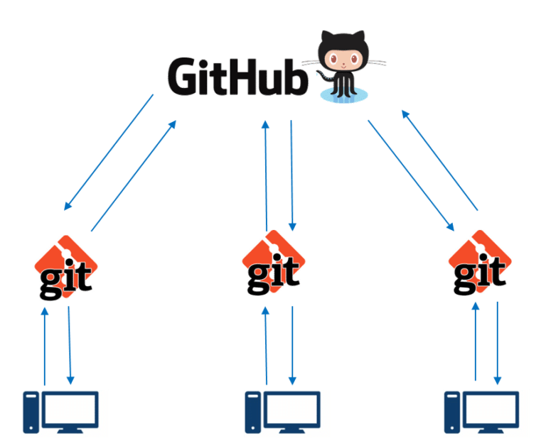
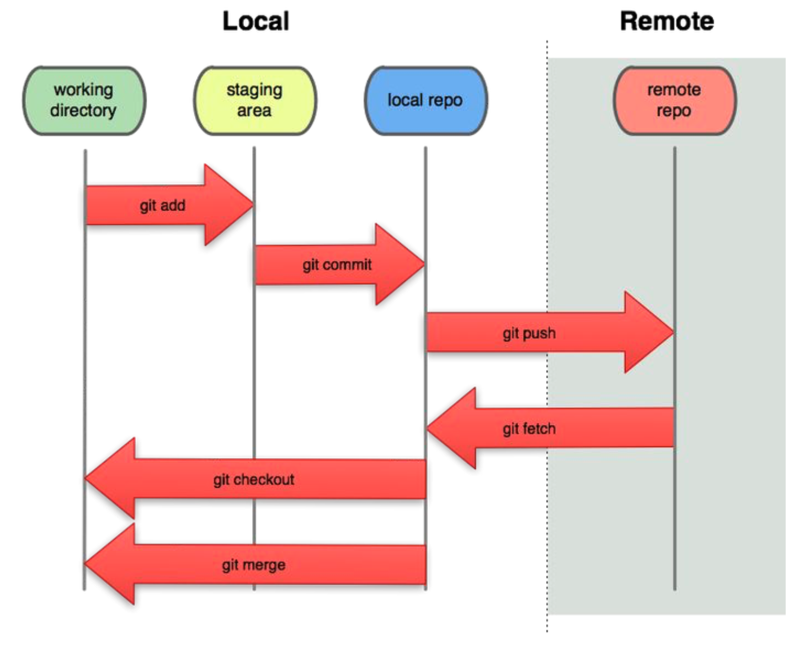
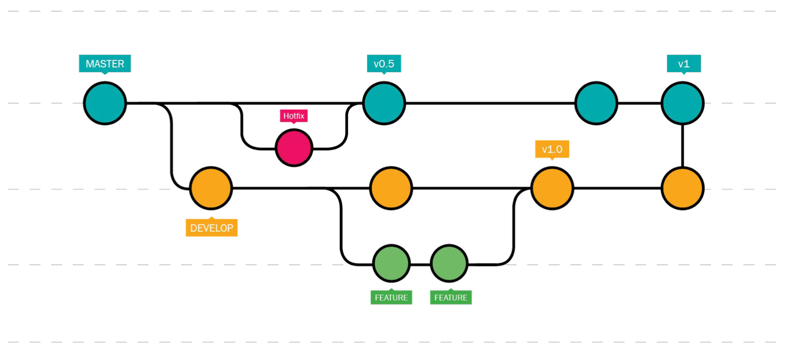
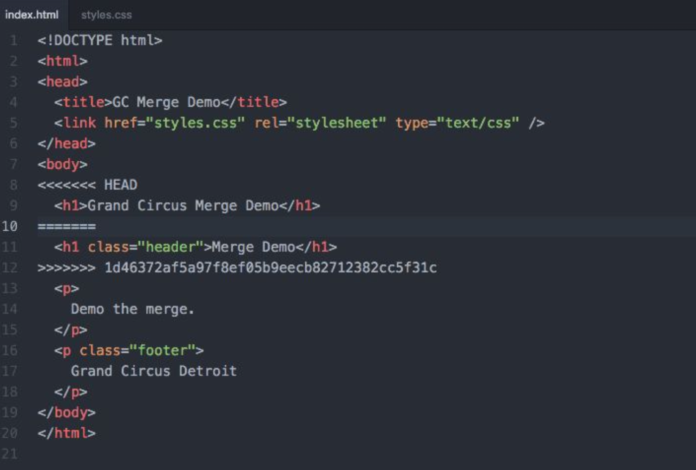

# Quarter 2, Lesson 2 – Collaborating with Git
{:.no_toc}

{: .note }
**Reminder**: Read the [Quarter 2 Syllabus](../../../../syllabus) and [Quarter 2 Project](../../../../assignments/projects/q2) specifications, and sign up for a [Week 3 TA Check-In](../../../../assignments/projects/q2-checkin).

---

## Table of contents
{: .no_toc .text-delta }

1. TOC
{:toc}

---

## Overview

You've already used Git and GitHub before in some capacity – for instance, in DSC 30 and 80, you used it to access assignments, and in DSC 180A you created a few repositories to submit your work. However, you may not have had to use Git to work in a team, and as such may not be aware of some of its more powerful features. 

In this lesson, we'll review the basics of Git and give you tips on how to work with Git on a team. **You will** mess up version control when working with others on your project; knowing the basics of how Git works will make it easier to fix things! When you use Git properly:
- You'll be able to automatically backup your work without having to make copies.
- Reverting to a previous version of your work, if, say, you want to undo someone's work, is easy.
- You and your teammates will be able to work at the same time without running the risk of ruining others' work.

Note that this lesson will only scratch the surface of Git's features; there are plenty of articles online, like [this one](https://www.atlassian.com/git/tutorials/syncing), that cover more details.

---

## Fundamentals

Up until now, you may have thought of the terms _Git_ and _GitHub_ as being synonyms, but that's not quite the case:
- **Git** is an open-source "distributed version control" system. This is a fancy way of saying that it's a tool that tracks the version history (i.e. changes) of your code and stores it on your local computer. Git doesn't inherently rely on the internet. Git is not the only version control system; [SVN](https://www.perforce.com/blog/vcs/git-vs-svn-what-difference) is another.
- **GitHub** is a remote server that allows for the syncing of distributed Git-versioned projects. For instance, if three team members are working in parallel on the same code base, and each is using Git locally on their computer, GitHub will combine all three version histories and store it in one place. While GitHub is the most popular Git-based platform, there are several others, including [BitBucket](https://bitbucket.org) and [Gitlab](https://about.gitlab.com). GitHub is owned by Microsoft.

<center>

<br>

(<a href="https://d1jnx9ba8s6j9r.cloudfront.net/blog/wp-content/uploads/2017/11/GitHub-How-to-use-GitHub-Edureka-768x617.png">source</a>)

</center>

### Commits

The core building block of Git is the **snapshot**. A snapshot records what your files look like at a particular instance in time. Think of creating a snapshot as saving your work.

Note that Git only stores the differences between snapshots, rather than entire copies of your repository at every snapshot. This makes the version history dramatically smaller. However, this only works efficiently in cases where Git is good at determining the difference between files. This is generally true for text-based files, but not in the case of binary files, which are how images are stored in notebooks. So, if you have a notebook that programatically generates plots or images and repeatedly commit versions of that notebook, Git will end up storing copies of each version of the notebook, which will lead to large repository sizes.  

In Git-speak, the act of creating a snapshot (i.e. saving your work) is called **committing**. A commit consists of:
- Information on how the files changed from the previous commit.
- A reference to the previous commit. (You can almost think of a project's version history as a linked list of commits!)
- A unique identifier (hash code).

To create a commit, use the syntax `git commit -m "commit message"`. The commit message should be a human–readable message explaining the difference between the current and previous commit.

{: .note }
There's a good chance you've written commit messages like "Does this work?" or "I'm tired" before, out of frustration. Moving forward, try your best to use descriptive commit messages that will be useful when you look back on them.

### The Anatomy of a Repository

A repository is a collection of files and their version history. This history lives in a hidden directory called `.git` at the root level of a Git-initialized repository. To add Git tracking features to an existing folder, run `git init`; however, you often won't have to do this directly since it's common to initialize a repository directly on GitHub and `git clone` it locally, at which point a `.git` folder already exists.

The `.git` directory of a repository contains:
- An index of all files being tracked by Git.
- Commit hashes and "diffs" (the differences between commits).
- The remote address of a repository on GitHub, if one is set up. This remote repository is known as the `origin`, as in, where the repository was originally cloned from.

<center>

<br>

The contents of the <code>.git</code> folder for the repository that hosts dsc-capstone.github.io. Note that most of these files are not human-readable.

</center>

### Navigating a Repository

<center>

<br>

</center>

There are a few different "places" in which you will work in a repository on your computer:

- The **working directory** is the file system that you see on your local machine, that contains the files you're editing.
- The **staging area** consists of the files that you'd like to include in your next commit. Add a file to the staging area by running `git add <file name>`. You can see the files in staging by running `git status`.
- A snapshot saves the state of the staging area when you make a commit – if you don't `add` a file to the staging area, its changes will not be saved in the commit.

There are two main ways to interact with a remote repository (which, again, is a repository on a server like GitHub). 

- To download the changes made by someone else to a remote repository, you **fetch** the changes by running `git fetch`. This brings the changes to your local repository, but not into your working directory (see the diagram above). The command you're more familiar with is `git pull`, which is a combination of `git fetch` and `git merge`, which merges the remote repository into your working directory.

- After committing your changes to your local repository, in order to add them to the remote repository, you `git push`. This is a [shortcut](https://stackoverflow.com/questions/48373771/when-to-use-certain-arguments-with-git-push) for `git push origin main`, which specifies that you want to push to your remote repository using the changes in the main branch of your local repository. **Always exercise caution when pushing changes to the remote repository, especially in the `main` branch!**


## Branching

In Git-speak, a "branch" is an independent copy of the files in a repository. Your repository has a single `main` branch, which should contain the latest **runnable** version of your code. Think of the `main` branch as the "production" branch.

### Single-Branch Workflows

You're likely used to using Git in a centralized fashion, meaning that all of your work was done in the `main` branch. Here's how a single-branch workflow looks when working individually:

1. Pull the latest version of the repository from remote, using `git pull my_repo`.
1. Add changed files to staging, e.g. `git add main.py`, `git add data/test_data.csv`.
1. Commit the staged changes with a helpful commit message, e.g. `git commit -m "Updated add_integers and added test data."`
1. Push the changes to remote, using `git push`.

<a name='AB'></a>

While this workflow is useful when working alone – say, when you need to have a copy of your code on both your local machine and on DSMLP – it can get messy quickly when working with others. Imagine the following scenario:
- You pull the remote repository.
- Your teammate pulls the remote repository and makes changes to files A and B.
- You make changes to files A and B without repulling.
- You try to push your changes to files A and B, but your push is rejected, because Git doesn't know how to combine your changes with your teammate's changes.

This is known as a **merge conflict**, and you've likely run into one before. When working on larger projects, this single-branch workflow gets messy quickly, and there's a better solution – using multiple branches.

### Multiple-Branch Workflows

Recall, a branch is an independent copy of the files in a repository. One creates a branch by "branching off" an existing branch, most commonly the `main` branch. Let's look at an example workflow.

<center>

<br>

</center>

In the figure above, each color is a different branch and each node is a commit. Work on the code moves from left to right.
- The teal nodes represent the `main` branch, which contains the latest **runnable** version of a project's code – it always "work."
- The yellow nodes represent a `develop` branch, which is used for **experimentation**. From there, more branches are created to implement specific features, in order to not introduce any errors in the `develop` branch.
- The pink node represents a `hotfix` branch, is was created to fix a bug in `main` that has nothing to do with the work in `develop`. After making commits in the `hotfix` branch, the `hotfix` branch is merged back into `main`, which now reflects the latest changes from `hotfix`.
- Eventually, the `develop` branch is merged back into `main`, at which point `main` will contain new, working features.

{: .note }
**In DSC 180B, each member of a group will work on a separate branch, and the group will merge all branches into `main` once a week.** 

That is, you will each have your own version of a `develop` branch. Instead of simply naming your branches `develop`, your branches should be named and separated based on **features** – that is, create one branch for updating your data cleaning code, another branch for updating your model's features, etc. If one person is working on multiple unrelated tasks in a single repository, they should use a different branch for each task, too. You may elect to include team members' initials in branch names, e.g. `SR_etl`.

You may wonder how this helps avoid merge conflicts – **it doesn't**. However, when using multiple branches, it becomes obvious **how** to merge changes between the two branches, since each branch has a specific purpose.

Let's look at how such a workflow may look in practice. Suppose we have a working `main` branch and want to update our ETL code to add a new data source.

1. Create a new branch off main for updating ETL code and switch to it, using `git checkout -b update_etl`.
1. Do work in `update_etl`.
1. Add and commit changes, e.g. `git add etl.py` and `git commit -m "Updated ETL pipeline."`.
1. Push `update_etl` to remote, using `git push` (or `git push origin update_etl`).

Once we've finished working in the `update_etl` branch, we'll need to merge it back into `main`. To do so:

1. Switch to `main`, using `git checkout main`.
1. Pull the latest version of main, using `git pull`.
1. Switch back to `update_etl`, using `git checkout update_etl`.
1. Merge `main` **into** `update_etl`, using `git merge main`. This will require fixing merge conflicts; see below for tips.
1. Push the latest version of `update_etl` back to remote.
1. Make a [pull request](https://docs.github.com/en/pull-requests/collaborating-with-pull-requests/proposing-changes-to-your-work-with-pull-requests/about-pull-requests) on GitHub, telling your other team members what you've changed and asking them to review your work.
1. Team members, if they approve, will merge the pull request directly from the website. Now, `main` will reflect your changes from `update_etl`.
1. Locally, switch back to `main` and pull, using `git checkout main` and `git pull`.

---

## Guidelines

### Merge Conflicts

When using `git merge main`, or when in scenarios like the one described [here](#AB), you're likely to encounter merge conflicts. The only way to resolve merge conflicts is to open the impacted file(s) and manually decide which branches' changes to keep.

<center>

<br>

</center>

In the example above, there are two versions of the header – one above the `======`, and one below.

```html
<h1>Grand Circus Merge Demo</h1>
```

```html
<h1 class="header">Merge Demo</h1>
```

Once you decide which version to keep, you can commit your changes.

### Version Control and Notebooks

Under the hood, Jupyter Notebooks are stored as JSON, a file format for storing data. Unfortunately, fixing merge conflicts is notoriously difficult in JSON, particular when code **output** is present. After all, Git is meant to version code, but notebook outputs are data.

As we saw in DSC 180A, there are two kinds of notebooks – notebooks in which code is prototyped and notebooks that generate code-driven reports.

- Code prototyping notebooks should be personal and not used for collaboration. Whenever you write code that others need to use, it should be stored as library code (e.g. as functions in a `.py` file). If you'd to commit development notebooks, **never** commit them to `main`.
- Code-driven reports should be versioned, but **always clear output** before committing, so that only code is versioned! Additionally, reports should always be quick to run; if not, save intermediate steps to files so that the report is generated quickly. If you want to commit output (e.g. a report), export a static document (e.g. HTML or PDF) into the `docs` directory of your repository.

### Version Control in DSC 180B

To recap what is expected of you:

- You must have a **public** GitHub repository in which all of your code is written. 
    - Your repository should have a descriptive name, **not** something like `DSC-180B-Capstone`. (It looks rather unprofessional to future employers when your repo contains a course code – you're building much more than a class project!)
    - One group member will have to create the repository; others should be added as collaborators.
- Team members should each clone the repository and `checkout` their own branches.
- Before your weekly check-in with your mentor, all group members should merge their latest work into `main`.
    - Branches should be small in scope and correspond to weekly tasks – the longer you wait to merge a branch into main, the harder it becomes.
    - Reviewing pull requests for merging is a good way to "get up to speed" on what everyone else did that week!

---

## Other Resources

While there numerous helpful StackOverflow answers for various Git problems (look for answers with many upvotes), try to understand what the answers are doing, otherwise you may lose unintended work! 

- If you want to revert changes back to a specific commit, follow the steps [here](https://stackoverflow.com/questions/4114095/how-do-i-revert-a-git-repository-to-a-previous-commit).
- If you want to remove a large data file that you added by mistake to the repository, follow the steps mentioned [here](https://stackoverflow.com/questions/2047465/how-do-i-delete-a-file-from-a-git-repository) or [here](https://docs.github.com/en/repositories/working-with-files/managing-large-files/about-large-files-on-github).
- [Understanding Git Conceptually](https://www.cduan.com/technical/git).