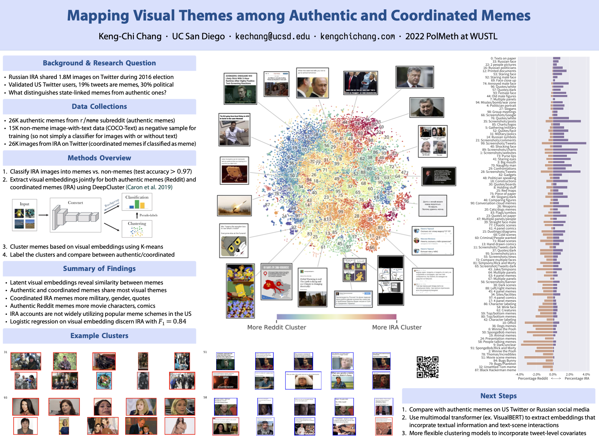

# Quarter 2, Lesson 4 – Posters and Oral Presentations
{:.no_toc}

{: .note }
On **February 12th** – **in just two weeks** – you'll be required to submit checkpoints for your report and code.    In the following weeks, you'll be required to submit checkpoints for your **poster** (**February 19th**) and **website** (**February 26th**). Ultimately, your poster and website will be seen by your peers, mentors, industry partners, future employers and grad schools, and the community more generally – **you should expect to spend a significant amount of time on each, so that you and your mentor are proud of the result**.    This lesson will give you guidance on how to prepare a scientific poster and prepare for the showcase; next week's lesson will focus on websites.

[Submit your final poster PDF (due March 9th at 11:59PM) here.](https://docs.google.com/forms/d/e/1FAIpQLSfoQiyTe5mNXIYqrerMA2Y9GMaCajPU8EMM-xkuceg6t4cLyA/viewform){: .btn .btn-blue }

---

## Table of contents
{: .no_toc .text-delta }

1. TOC
{:toc}

---

## Overview

The [capstone showcase on March 15th](https://hdsishowcase.com) will be a poster session, which means you will present your project using a poster. During your [1.5 hour block](https://docs.google.com/spreadsheets/d/10avPsPgSc8wCyzabUxKxe3MDXsst9lkwDb7tjwz7IlI/edit?usp=sharing), you and your group will stand next to your poster as attendees approach you to ask and hear about your work.

If you've never seen a poster session before, you can see footage of the 2018 CSE Internship Symposium poster session below.

<iframe width="560" height="315" src="https://www.youtube.com/embed/wYV-ixiwE6E" title="YouTube video player" frameborder="0" allow="accelerometer; autoplay; clipboard-write; encrypted-media; gyroscope; picture-in-picture; web-share" allowfullscreen></iframe>

---

## Conversations

At the poster session, when someone approaches you and your poster, the first question you can expect them to ask is

> So, what's your project about?

To answer their question, you'll give a **short, well-rehearsed elevator pitch** that introduces your project, the context in which it lies, and its impact. As a reminder, attendees at the capstone showcase will come from a variety of backgrounds:
- Fellow capstone students.
- Other UCSD students (some data science, some not).
- Faculty mentors.
- Industry mentors.

As such, the elevator pitch you start with should be general enough so that all audiences will be able to understand the core elements of your work just by listening to it. As you did for the elevator pitch you recorded in Quarter 1, and as you read about in [last week's lesson](../03/#providing-context), you should structure your elevator pitch as follows:
- **Context**: Tell the audience what you are going to tell them – tell them why they should care.
- **Content**: Tell them about your approach and results.
- **Conclusion**: Recap your content, and how it is relevant with regards to the context you provided at the start.

Keep your elevator pitch short, no more than 2 minutes long. This is so that, after hearing your elevator pitch, attendees have time to ask questions to hear more about the parts of your project that interest them, before they walk away to another project. While your elevator pitch will be general, you should be prepared to answer questions that involve varying levels of detail; a first-year data science major in DSC 10 will ask different questions than a data science professor who is mentoring other groups will.
 
### Preparation

The first key to success is rehearsing your elevator pitch. You'll be required to do this with your mentor in section, and with TAs in Week 8. But you'll need to practice much, much more than twice – in the weeks leading up to the showcase, plan to practice your elevator pitch repeatedly with friends and family of a variety of academic backgrounds. **No matter how confident you are in your presentation skills, practice, practice, practice!**

When practicing your elevator pitch, you may find it useful to use slides to _structure_ your presentation (though, of course, you will **not** be able to actually present the slides at the poster session). We suggested this approach in the [Quarter 2 Proposal Elevator Pitch](https://dsc-capstone.github.io/assignments/projects/q2-proposal/#tips) assignment in Quarter 1. **Ultimately, though, you'll need to be able to deliver your elevator pitch without referring to notes of any kind.** Sure, you'll have your poster, but while you're speaking, your poster should serve as a visual aid that contains visualizations and summaries of key results. You can point to various figures and sections of your poster, but **make sure you are not simply reading off your poster – that's not engaging.**

The best way to prepare for the questions you'll receive at the showcase is to let your audiences during your practice runs ask questions, and come up with answers to all of them. This is why it's important to practice giving your pitch to different audiences – different audiences will be curious about different aspects of your project and will require different levels of detail to be satisfied. As we said in the Quarter 2 Proposal Elevator Pitch guidelines, **make sure that you can turn your pitch into a conversation if someone asks a question in the middle**.

{: .note }
Remember that all group members will receive a presentation grade – so all group members need to be able to talk and answer questions about the project at the showcase.

---

## Poster Guidelines

Your poster will primarily serve as a visual aid as you present your work. It should contain:
- A prominent, informative title, that immediately tells the viewer what the project is about. (This should be the same as the title of your paper; if you haven't thought about what this will be, now is as good of a time as any.)
- The names, emails, and institutional affiliation for all group members, including your mentor.
- One section for each section of your report, in which the key points are summarized as **short bullet points** and in **tables and graphs** where possible.
- A link to your project website (ideally using some sort of URL shortener or QR code), which will also have links to your paper and GitHub repository.

While the focus should be on visuals, your poster should also be self-contained – just by looking at your poster, someone should be able to understand the main idea behind your project, the context in which it exists, and its impact, without you having to be present. After all, your poster may eventually be hung up in the hallway of the new HDSI building – passerbys looking at your poster should be able to understand what you did.

{: .note }
On March 9th, you will submit your poster to us as a PDF of size **48" x 36"**. Make sure that all text and figures on your poster are large and legible – to do this, ensure that your figures are exported at a resolution of 300 DPI (dots per inch). See [here](https://posterprintshop.com/file-preparation/) for some guidelines.

We won't reinvent the wheel here – there is a wealth of resources available online that you can consult for guidance on how to produce a poster. **Your mentor is also a valuable resource – they've almost certainly created a poster before, and ultimately they will be the ones grading your poster**.

For actually creating your poster, you're free to use any tools you'd like, though two common choices are LaTeX and Google Slides/Powerpoint. You'll find templates in all sorts of formats online. For one, Kengchi Chang (a methodology TA) has provided links to [two LaTeX templates](https://github.com/KengChiChang/poster_templates) he has used; Example 1 looks like this:

Below are several other resources. You'd be well suited to read the links in the "Required Reading" section before starting on your poster.

### Required Reading

- Haq, [Making the most of your conference poster](https://www.postgraduate.uwa.edu.au/__data/assets/pdf_file/0007/623527/Preparing_your_conference_poster.pdf). This set of slides clearly describe what the purpose of a scientific poster is and how to structure one. 
- Alley, [Scientific Posters](http://www.craftofscientificposters.com/design.html). A good, quick page to read to understand the purpose of a scientific poster, with examples.
- Ellis, [Data Science Presentations](https://docs.google.com/presentation/d/1P0AfZe1li4Nlldk9x-F1T2TwxTQdqlA1T0xfshasmTg). Not all of the content in these slides are directly applicable, since **you're not creating slides**, but many of the examples towards the end of how to produce effective visualizations are directly relevant, since much of your poster will consist of visuals.
- NeuroWire, [Tips for presenting your scientific poster at a conference](https://www.scientifica.uk.com/neurowire/tips-for-presenting-your-scientific-poster-at-a-conference). An excellent article that details what the role of your poster is in your overall presentation, and how to prepare for the poster session more generally.

### Additional Resources

**Templates**:

- [Overleaf](https://www.overleaf.com/gallery/tagged/poster) has a large library of ready-to-go LaTeX templates.
- [Nathaniel Johnston's LaTeX Poster Template](http://www.njohnston.ca/2009/08/latex-poster-template/).

**Examples**:
- [UC Davis Academic Posters](https://urc.ucdavis.edu/photo-galleries/uc-davis-academic-posters). This is a gallery of posters created by undergraduate student researchers at UC Davis.
- [UCSD CSE Internship Symposium 2021](https://sites.google.com/eng.ucsd.edu/cseinternshipcourses/archive/2021-virtual-symposium?authuser=0). Click around to see several examples of posters, though the examples you'll see here fit a slightly different role (they aren't tied to scientific papers). Many of the resources linked on this page are taken from [here](https://sites.google.com/eng.ucsd.edu/cseinternshipcourses/current-students/final-assignment/poster?authuser=0).

**Guidelines**:
- Hall, [Fixing academic posters: the #BetterPoster approach](https://astrobites.org/2020/02/28/fixing-academic-posters-the-betterposter-approach/). This poster template looks clean, but the design is quite radical – ask your mentor for their thoughts on this design.
    - A related video: [How to create a better research poster in less time](https://www.youtube.com/watch?v=1RwJbhkCA58).
- Cranor, [Research Posters 101](https://dl.acm.org/doi/pdf/10.1145/332132.332138).

{: .note }
**Start early**. Figure out what content you'd like to put on your poster, and then try and find a template (or create your own) that works for your content.

[Submit your final poster PDF (due March 9th at 11:59PM) here.](https://docs.google.com/forms/d/e/1FAIpQLSfoQiyTe5mNXIYqrerMA2Y9GMaCajPU8EMM-xkuceg6t4cLyA/viewform){: .btn .btn-blue }