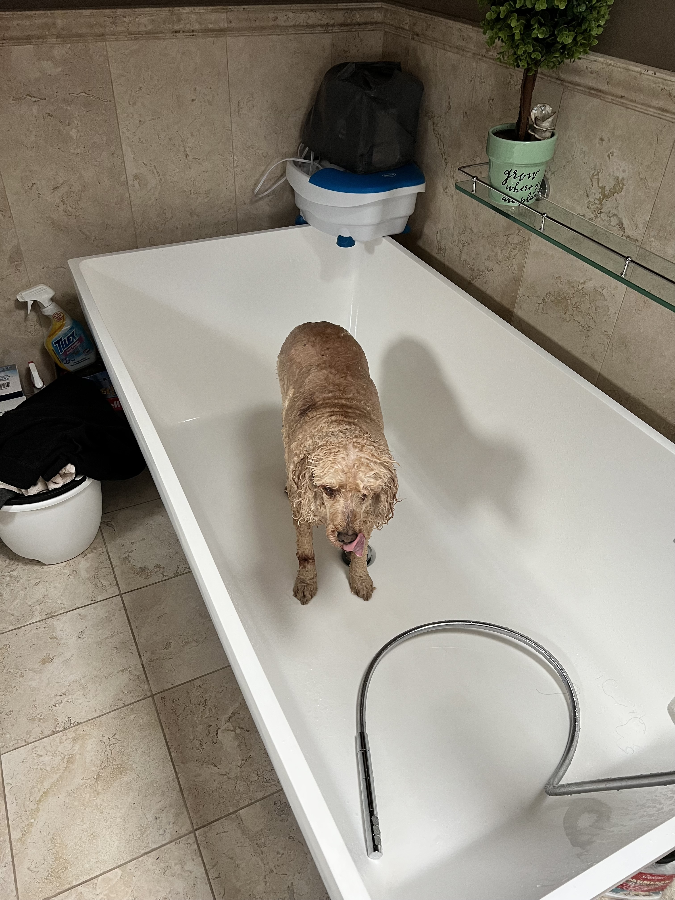

# Lesson 0 – Introduction

## DSC 180A, Fall 2022

### Suraj Rampure

---

### Agenda

- Introductions.
- Capstone program overview.
- Syllabus and logistics.

---

### Suraj Rampure (call me "soo-rudge")

- Originally from Windsor, ON, Canada 🇨🇦.
- BS (’20) and MS (’21) in Electrical Engineering and Computer Sciences from UC Berkeley 🐻.
- Second year teaching Data Science at UCSD.
    - So far, taught DSC 10, 40A, 80, and 90.
    - Also teaching DSC 10 this year.
- Outside the classroom: watching basketball, traveling, learning to cook, watching TikTok, FaceTiming my dog 🐶, etc.
- **Not Aaron Fraenkel**, who designed the capstone sequence.

---

    <table ><tr>
        <td>   </td>
        <td>  </td>
        <td>  </td>
    </tr></table>

_My summer._

---

### Course staff

In addition, we have 7 teaching assistants, who will grade parts of your work and guide you through your projects.

- Keng-Chi Chiang (Political Science PhD student, prior capstone TA)
- Praveen Nair (CSE MS student, prior DSC undergrad)
- Teresa Rexin (Statistics MS student, prior capstone TA)
- Samanvitha Sateesha (CSE MS student)
- Umesh Singla (CSE MS student)
- Yuyao Wang (Math PhD student)
- Xinrui Zhang (CSE MS student, prior DSC undergrad and capstone TA)

See their individual expertise at dsc-capstone.github.io/staff.

---

## Capstone program overview

---

### Capstone program goals

By the end of the capstone program, you will apply data science skills through the lifecycle of a **two-quarter project**. Specifically, you will:
- Learn methodological best practices for working on large projects. Specifically, you will have learned about:
    - Reproducible work.
    - Effective (visual, oral) communication of work and results.
- Learn how to start an investigation with a question instead of a method.
- Complete a detail-oriented pursuit of a proposal in your chosen domain.
- **Produce and show off work that you are proud of!**

---

### Capstone challenges

By the numbers, we have a huge capstone program: 203 students, 34 domains, and 50 mentors + liaisons. This invites some unique challenges:
- Topical variety: mentors have varying research interests, and as such, projects can span almost anything imaginable.
- Evaluation: how do we consistently evaluate such varied student work?
- Flipped background: in a typical capstone program, students come in with domain knowledge. In our program, students come in with a methodological toolkit, but no domain knowledge.

These challenges motivate the structure of the program!

---

### Structure of the capstone program

Mentors are responsible for sponsoring a "domain" that can sponsor multiple projects. Students enroll in domains based on their interests.

| Quarter | Domain | Methodology |
| --- | --- | --- |
| 1 | Getting up to speed in domain by working on a replication project (Quarter 1 Project) | Software development, reproducibility, environment independence |
| 2 | Working on an original project (Quarter 2 Project) | Project management, effective communication skills |

---

### Domain

- In Quarter 1, you will focus on learning a domain.
- Each week, your mentor will assign you tasks and readings.
- At the end of the quarter, you will:
    - Use these tasks to complete your Quarter 1 Project, in which you will have replicated a known result.
    - Propose a more independent Quarter 2 Project in groups. **The Quarter 2 Project is the real capstone project!**
- In Quarter 2, you will spend most of your time executing your Quarter 2 Project.

---

### Methodology

- The methodology portion of the course teaches best practices for data science projects across a wide variety of domains:
    - Responsible resource usage (remote vs. local development).
    - Reproducible research (Git, Docker, Python packages, updateable reports and notebooks).
    - Effective communication (scientific writing, oral presentations, teamwork).
- You will directly the standards you learn about in the methodology component in your domain work.
    - The code you write in your projects will be graded against these standards.
    - You will analyze the writing of a publication in your domain using these standards.

---

## Syllabus and logistics

---

### Course website

Bookmark it!

 

<h3><a href="https://dsc-capstone.github.io">dsc-capstone.github.io</a></h3>

 

This is where all methodology content and assignment descriptions live. Make sure to read the [**Syllabus**](https://dsc-capstone.github.io/syllabus)!

---

### Technology

- [EdStem](https://edstem.org/us/courses/28947/discussion/): Q&A forum for methodology.
    - Make sure you're active here, since this is where all course-wide announcements will be made.
    - Your domain mentor will let you know how they want to communicate with you, but it won't be through EdStem.
- [Gradescope](https://www.gradescope.com/courses/442598): where all assignments will be submitted.
- DSMLP: campus computing server (similar to DataHub). More on this soon.
- No Canvas! ❌

---

### Discussion sections

- Discussion section is where you meet with your mentor each week.
    - See [here](https://docs.google.com/spreadsheets/d/1WSSB0kXRisLVnvrckY0VpJ8mPBt4yNXCyNfEAJ7x2J8/edit#gid=637456872) for the schedule. If in SDSC, see [here](https://edstem.org/us/courses/28947/discussion/1798016) for the code.
- **Attendance is mandatory, and you must come to discussion section prepared to discuss the tasks and readings they've assigned you!**
- Discussions are for:
    - Asking questions to understand data generating processes and domain-specific methods.
    - Brainstorming possible Quarter 2 Project proposals with peers.
- Unless they are domain specific, don't ask "tech support" questions in discussion – save those for methodology office hours (more on those soon).

---

### Mentor interactions

- Expect your weekly work to be difficult. **Your mentors are there to help – ask lots of questions!**
- Mentors will each hold at least one office hour per week (either regularly scheduled or by appointment).
    - If they haven't listed them [here](https://docs.google.com/spreadsheets/d/1WSSB0kXRisLVnvrckY0VpJ8mPBt4yNXCyNfEAJ7x2J8/edit#gid=637456872), ask them for the schedule in your first meeting.
    - You should attend these at least **three times** throughout the quarter.
- Mentors largely operate unaware of how the lecture portion is structured. Give them context, if asking them a question about the domain that relates to lecture!
    - If they ever give you instructions on an assignment that contradict our instructions, **listen to them** (unless something is dramatically different, in which case, let me know).

---

### Participation (10%)

- In total, **domain** participation amounts to 10% of your grade.
- 5% of this comes from weekly participation questions that you must submit answers to **24 hours before your discussion section**.
    - Your mentor may come up with custom questions for you to answer; otherwise, you should answer the [default questions](https://dsc-capstone.github.io/assignments/participation/q1) posted on the course website.
    - Answering these before section is crucial for preparing both you and your mentor for section.
    - These are in addition to any tasks and readings they assign you, which you won't necessarily submit anywhere.
- The other 5% comes from an overall participation grade that your mentor will assign you at the end of the quarter.
    - Participation in discussion section is required!

---

### Quarter 1 Project (70%)

- Your Quarter 1 Project will be a report that summarizes the work you've done in learning your domain. You'll work on it either individually or in groups, depending on your mentor's preferences.
- Part 1 (Checkpoint, due Week 5):
    - Report: introduction to problem, description of data and/or methods.
    - Code: data processing, initial method implementation.
- Part 2 (Final, due Week 10):
    - Report: results, discussion of shortcomings and possible improvements
    - Code: code that produces the results, using best practices.
- The finalized Quarter 1 Project spec will be posted in ~2 weeks, but it won't change much from the one currently linked in the syllabus.

---

### Quarter 2 Project Proposal (15%)

- Each Quarter 2 Project is worked on in groups of 2-4. It's up to your mentor to choose the groups. You'll submit your proposal with the same group.
- Deliverables for the proposal include:
    - A written proposal, containing background research.
    - A plan/schedule for execution.
    - A 2-3 minute elevator pitch, aimed at a general audience.
    - A skeleton for the project (i.e. a GitHub repo with boilerplate).
- You domain mentor will approve your proposal, based on their expertise and flexibility. 
- Sticking close to your work in Quarter 1 will allow you to move faster in Quarter 2.
- The finalized Quarter 2 Project Proposal spec will be posted in ~4 weeks, but it won't change much from the one currently linked in the syllabus.

---

### Quarter 2 Projects

- At the end of Quarter 2, you will submit:
    - A public GitHub following best practices for data science project development (a developer should be able to extend your work from this code).
    - A public website explaining the project to a specific audience.
    - A PDF report, following best practices in scientific writing.
    - An elevator pitch (e.g. helpful in job interviews).
    - A longer slide-based talk.
- See last year's Quarter 2 Projects [here](https://dsc-capstone.github.io/projects-2021-2022/).

---

### Methodology lectures

- Methodology lectures will be delivered **asynchronously** in the form of a reading.
    - There is a methodology lesson for today, too – more on this soon.
- Each Sunday, a new "lesson website" will be posted on the course homepage. Read through the lesson article when it's released.
- The live lecture time – Monday 3-3:50PM and 4-4:50PM – will be used to provide you help with the lesson. You can attend either one.
    - They will be recorded (though it's not clear how useful the recordings will be).
- **Advice:** treat the lecture help sessions as lab time – come here to do the readings, and ask questions as they come up.

---

### Methodology assignments (5%)

- There are 5 methodology assignments, each of which is associated with a methodology lecture.
    - Example: access campus computing servers.
    - Example: create a Docker container for your project.
- These are typically due on Sundays and should not take very long to complete.
    - Methodology assignment 1 is due **this Sunday**.
- **Advice: come to the lecture help sessions to work on methodology assignments!** We might even walk through them.
- In addition, we will hold methodology-specific office hours; see the [Office Hours](https://dsc-capstone.github.io/office-hours) page on the course website for the schedule.

---

### Summary: graded components

|Component|Weight|
|---|---|
| Participation questions | 5% |
| Overall participation | 5%|
| Quarter 1 Project | 70% (50% report, 20% code; checkpoint + final for each) |
| Quarter 2 Project Proposal | 15% |
| Methodology assignments | 5% |

---

### Grading

- Assignments are graded by a combination of mentors and DSC 180A TAs.
- Domain mentors will grade your reports.
    - Your reports should make it clear that your code is reasonably close to correct!
    - Domain mentors may give you feedback in office hours instead of through written feedback.
    - Their feedback will be from the standards of the domain!
- DSC 180A TAs will grade your code and other assignments according to methodological standards taught in lecture.
- All assignments graded as A/B/C/F only (i.e. 4/3/2/0 only, no plus/minus) using [this rubric](https://dsc-capstone.github.io/syllabus/#general-rubric).
- Your final grade is computed by the standard GPA conversion.

---

### Summary: meetings

- Discussion.
    - Required.
    - Need to complete tasks, readings, and participation questions before.
- Lecture help sessions.
    - Held on Mondays. Optional and recorded.
    - Come for help with lecture (released the day before) and the associated methodology assignment. 
- Office hours.
    - Domain-specific office hours, hosted by mentors.
    - Methodology office hours, hosted by DSC 180A course staff.
    - Different questions go to different "experts."

---

### Advice

- Work slow and steady. This material is hard and you will hit unexpected obstacles.
- Ask questions!
    - Access to a mentor like this is rare at UCSD!
    - Research is deceptively hard – if you are confused, others likely are too.
    - Domains benefit from discussions and working together!
- Don't be afraid of redoing work. You will rewrite your code many times.
    - It doesn't mean it was wrong the first time; it means you understand it in a different way.
 
 ---

 ## This week

 ---

 ### Action items

 - Read the [Servers](https://dsc-capstone.github.io/lessons/q1/01/) lesson that's been posted on the course website. It'll show you how to access DSMLP, our campus computing cluster.
    - I'll stick around to answer any questions with it.
 - Complete [Methodology Assignment 1](https://dsc-capstone.github.io/assignments/methodology/q1/01) by Sunday.
 - Go to your first discussion section.
 - Submit your first participation assignment **next week** (i.e. 24 hours before your discussion section in Week 2).
