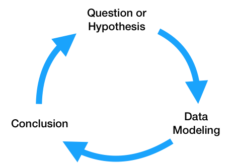
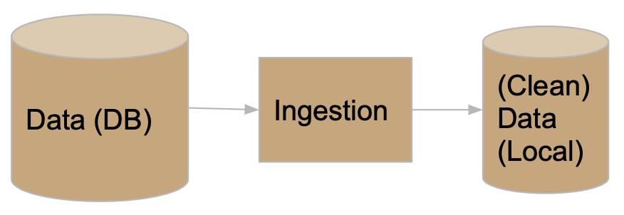

<script type="text/javascript" async
  src="https://cdnjs.cloudflare.com/ajax/libs/mathjax/2.7.7/MathJax.js?config=TeX-MML-AM_CHTML">
</script>

# Lesson 2 – Project Organization
{:.no_toc}

All lectures will be delivered as readings that you complete on your own time. Post questions with the lesson [here](https://edstem.org/us/courses/28947/discussion/1876813).

Make sure to read this article before moving on to [Methodology Assignment 2](../../../assignments/methodology/q1/02).

**Note:** Take a look at the new [Resources](../../../resources) tab of the course website.

---

## Table of contents
{: .no_toc .text-delta }

1. TOC
{:toc}

---

## Goals of Data Science Software Development

### Overview

At a high level, the **data science lifecycle** looks a lot like the scientific method you saw in elementary school.

<center></center>

While you may begin with a single question, after performing exploratory data analysis and building a model to answer your question, you will likely refine your original question or come up with more questions to investigate. As a result, the code that you write needs to be written so that it can support iteratively changing questions and analyses. Specifically, the code for a data science project needs to be:

1. Flexibly written, to adapt to changing questions.
1. Clearly documented, so that is clear – both to you and others using your code – what each piece does.
1. Reproducible, meaning that others should be able to run it themselves.

In theory, that sounds pretty straightforward. However, as you saw in DSC 80, the real data science lifecycle is anything but.

<a name='DSLC'></a>

<center></center>

This makes it even more crucial that you follow the three principles outlined above. If you're not careful, it's easy to fall in the trap of writing poorly organized code with many hard-coded pieces. This results in:
- Being able to execute fewer iterations of your project, and as a result, making slower progress on your project.
- Being unsure of _what_ your code is even doing, increasing the likelihood of making mistakes while iterating and making it unclear what your conclusions even are.
- Making it less likely that others will be able to use and replicate the results of your project, resulting in your project fading into obscurity.

The purpose of this lesson is to show you how to adhere to the three principles mentioned above, as **this will increase your chances of successfully executing your project**. The contents of this lesson will be relevant for the remainder of the capstone sequence; you will find yourself coming back to it often in the future.

### Managing Project Components

There are a plethora of tools used in industry for managing data science projects, far too many for us to make a dent in them in this course. Instead, we will expose you to a few popular tools that help solve core issues that will be relevant even decades in the future, once the current slate of tools is replaced.

<center>

<br>

<i>A small sample of tools that exist for managing data science projects.</i>

</center>

These core issues revolve around the fact that your project will be made up of several components. For instance, you may have separate components for ingesting and cleaning raw data, creating visualizations, and training models. Issues you need to be aware of are:
- **Communication**: How do these components all communicate with one another? In other words, what are the inputs and outputs of each component? It's important to be clear about what these are up front, to avoid confusion later on.
- **Isolation**: Your code should be written in a way such that each component is as isolated as possible. This way, when you want to make changes to one component – say, loading in another column at the very start of your pipeline – you don't have to make changes to all of your other components. This may happen if you have aspects of your modeling pipeline, like feature names, hard-coded throughout several different files. (It would suck to have to buy a new dashboard for your car every time you get a flat tire – the same principle applies here.)
- **Parallelization and Scale**: It should be clear _when_ each part of your project needs to be run, and whether different parts can be run in parallel. Similarly, it should be clear which components of your project will need to scale as the project grows in scope – for instance, if you collect 10x more data, at what stages will you need more compute resources?

One way we will address all of these issues is through the use of **configuration files**, in which you can specify and track hypotheses and desired outputs. As such, when new questions arise, you won't have to re-write your code; instead, you'll just run it with different configurations.

---

## The Anatomy of a Data Science Project

Let's look at how each component of the [data science lifecycle](#DSLC) interacts with your code.

### Domain Research

The code you write throughout your project will strongly depend on your domain. For instance, suppose you're working with driver data. In your data cleaning step, you may choose to keep only the drivers whose ages are at least 16, the legal driving age in California. This is a choice you had to make given your knowledge of your domain.

You'll make several such design decisions while working on your project:
- You may clean your data in a specific way.
- You may choose a particular column as a "target," and a subset of the remaining columns for features.
- You may build certain kinds of models over others.

It's important to document these choices and the context between them. This justification will appear in two places:
- In your final reports. For instance, in the EDA section of your report, you'd talk about what steps you took to clean your data and why they make sense.
- In code comments, whenever relevant. Take the drivers' age example, for instance. In the line where you keep only the drivers who are at least 16, you may add `# legal driving age`.

### Question / Hypothesis

You may start with an initial question to investigate, but as your project evolves, so will the questions you're interested in. To prevent having to re-write your codebase each time you come up with a new question, you should think about how your questions will be similar to one another so that you can **parameterize** your code.

Here's an example. Suppose you're looking at traffic stops data, and you're interested in whether "younger" people (< 30 years old) are stopped at higher rates than "older" people (>= 30 years old). Suppose you're also interested in answering this question across multiple years – say, for each year from 2016 through 2022 – and across multiple counties in California. The most straightforward approach here is to create functions that take in `year` and `county` as input and return just the data needed to look at stop rates for that combination of `year` and `county`. Then, in a **configuration** file, you can store all years and counties that you're interested in. Finally, you can call your data processing and hypothesis testing routines on all combinations of parameters in your configuration file. Note that in this approach, _each combination of parameters leads to a different question / hypothesis_.

One of the benefits of using configuration files, in addition to keeping your code robust and flexible, is that we can tell a server to run our pipeline for different combinations of parameters on different threads or machines, so that we can conduct our investigations in parallel. For instance, suppose there are 7 years (2016-2022, including both endpoints) and 3 counties (San Diego County, Orange County, and Los Angeles County) that we're interested in investigating. There are $$7 \cdot 3 = 21$$ combinations of year and county – wouldn't it be great if we could run our code for all 21 combinations at the same time?

If some aspect of your question is never going to change, e.g. if you're always only going to be looking at San Diego County, then it's fine to hard-code that throughout your codebase. However, it's generally a good idea to parameterize any aspects of your codebase that _could_ change to keep it adaptable to new questions.

In this course, we will typically store our configuration files in the JSON format, though there are a variety of other possible formats (YAML is popular, as are INI and CFG). You'll see example configuration files later on in the lesson.

### Data ETL (extract, transform, load)

As your project evolves, the data that you're working with may also change. For instance, the source where you're pulling traffic stops data from may update daily with the previous day's stop data. You need to make sure that your modeling component doesn't break just because we pulled in a new day's worth of data, or because an additional column was added from the data source. Of course, your code doesn't have to handle _all possible data sources_, but you should anticipate possible changes and prepare for them.

Here, configuration files will again be useful. For instance, you should explicitly mention which columns you want to use for transformations and model building, so that any new columns that are added in don't impact your model.

You should also think about _how_ you're accessing your data – an API? scraping? found a CSV online? – and _where_ you're storing it. To prevent having to re-pull your data each time your cleaning and transformation logic changes, separate the code you use for data ingestion from the code you use for cleaning and transformation, and store intermediate "raw" data to disk that you can re-use whenever you update your cleaning logic.

### Model Building

As you've seen in earlier courses, the model building process is not straightforward – you'll repeatedly try different combinations models and parameters until you feel that your model has sufficient _generalizability_ to unseen data. Continuing with the theme of parametrization, it's a good idea to store all "potential" parameters in configuration files, so that models can be trained and evaulated on different combinations in parallel.

Furthermore, it's encouraged to use frameworks that enable "pipelining", like `sklearn`, which you were exposed to in [DSC 80](https://dsc-courses.github.io/dsc80-2022-sp/resources/lectures/lec23/lec23.html).

### Continued Prediction

Often times, your project lives on well after you've built your "final" model. Your model may be deployed into production to make "live" predictions – for instance, each time you request a ride in the Uber app, it predicts the highest price you'll pay for a ride. 

The `model.predict` method that you'd use to make predictions in `sklearn` may actually be called via HTTP requests on a site that uses a Java backend. Once this happens, you may want to keep track of how well your model is performing – are its outputs still reasonable? Is it easy to re-train it to reflect updated data?

The use of pre-trained models, particularly in the case of deep neural networks, is quite popular today. For instance, you can easily use [OpenAI's GPT-3](https://openai.com/api/) language model without having to train it yourself. You should strive to build a model that you can similarly share with others, in the form of a Python package or a Docker container. That way, others can easily use your model to make predictions without having to run your entire pipeline.

### Conclusions and Reports

The final reports that you create will be written in some sort of markup language, like Markdown, and will explain your results and contain justification for all of the design decisions you made. Your reports will likely involve tables and visualizations that are derived from data. You should try to set up your report such that it automatically generates tables and visualizations using the other components of your project, so that if, say, your data is updated, you can update your report just by re-running your entire pipeline. This, of course, is not possible if your report includes screenshots from other parts of your project; instead, you'll need to programmatically create, save, and load images.

### Summary

In short, your projects should be:
- Flexible for quick iterations, through configuration files.
- Understandable through consumers of the output, through documentation and reports.
- Usable for developers and researchers extending your work, through documentation and containerization.

### Caveat: Methods-Focused Projects

You may wonder how much of this is applicable to you if your project doesn't involve data analysis. Indeed, many domains are more methods-focused, where they spend time developing new techniques for collecting or modelling data rather than the entire lifecycle. 

If this is the case, in addition to following general best practices for software development in your domain, **you will still have a data analysis portion in your project**, if only to demonstrate the usage and value of whatever it is you developed. You may have two repositories, one for the software package you develop and one for your "example" analysis (the former of which will be much larger).

---

## An Initial Template for Data Science Projects

Now that you understand how each step of the data science lifecycle plays a role in your project's structure, let's tangibly look at how you might structure your project.

### Configuration vs. Code

Up until now in this lesson, we've repeatedly emphasized the use of configuration files for storing parameters. However, it's not immediately obvious what parts of your pipeline belong in _code_ and what parts belong in _configuration files_.

Code that is used by other processes is called library code, or source code. Your source code may be run in notebooks that you use for EDA and for creating visualizations, and will certainly be run in your final `run.py` file that runs your entire pipeline. Source code will mostly be contained in `.py` files (or `.java` or `.cpp` files, for example). You are already used to using generic functions from libraries like `pandas` and `numpy`; the only difference here is that you are writing these functions yourself.

Configuration files, then, consist of parameters that your source code will use as inputs. For the most part, you will write configuration files in `.json`, but you _could_ also store configurations as global variables at the top of your scripts.

Aim to generalize, but don't overly generalize. It's fine to start writing code with some inputs "hard-coded", e.g. write filtering logic that creates a DataFrame of traffic stops in 2021 in Orange County, but at some point you should step back and generalize.

### A Simple Template

Here's a basic "template."

```
Project
├── code.py
├── config.json
└── script.py
```

Note that this example directory shows 3 files that are all in the same folder. Shortly, we will see more realistic example templates with multiple directories.

Specifically:
- `code.py` contains library code – that is, functions designed to execute your project. These functions should be parameterized to accept various inputs.
- `config.json` contains parameters for the functions in `code.py`.
- `script.py` imports `code`, loads `config.json`, and calls functions from the `code` module. (Note that this could also be a notebook, `script.ipynb`.)

For instance, `script.py` may contain:

```py
import code
with open('config.json', 'r') as fh:
    params = json.load(fh)

code.run_process(**params)
```

We will use the process above **repeatedly**.

(Aside: The `**` operator above _unpacks_ the entries of the `params` dictionary, so that they are all passed directly as inputs to `code.run_process`. As a crude example, if `f = lambda x, y: x + y`, then `f(**{'x': 2, 'y': 3})` evaluates to `5`. Read [here](https://www.educative.io/answers/what-is-unpacking-keyword-arguments-with-dictionaries-in-python) for more.)

### A Simple Example

Let's see how we might tangibly use the example template from above. Suppose we have code that pulls data from an API, and that the data is updated daily. We want to re-run this code regularly to update our stored data.

<center></center>

Our project may be structured as follows:

```
Project
├── README.md
├── data-params.json
├── etl.py
└── run.py
```

Let's look at each piece in detail.

#### `README.md`

All repositories you create should have `README` files that describe what is located where and how to run your project.

#### `etl.py`

`etl.py` contains our source code (i.e. it corresponds to `code.py` from the template). The functions written here are generic, and will be used throughout the rest of the project.

Note that _users_ of the code in `etl.py` (e.g. other people running your project who will just run `python run.py`) should not need to know _how_ the code in `etl.py` works in order to use it. You probably don't know how `pd.pivot_table` works under the hood, but you still use it – the same idea applies here. However, developers who want to extend your project _will_ have to understand how the code in `etl.py` works, and for that reason it still needs to be well-documented. Your library code will _not_ know who is going to call it, and for what purpose – the calling is done in `run.py`, using the parameters in `data-params.json`.

Here's an example of what `etl.py` might look like.

```py
'''
etl.py contains functions used to download DataFrames containing traffic stops data for different years and counties.
'''

def get_year_and_county(year, county):
    '''
    Return a DataFrame of traffic stops data for a given
    year and county.
    '''
    ...    
    return ...

def get_data(years, counties, outpath):
    '''
    Downloads DataFrames and saves them as CSVs at the specified output directory for the given years and counties.

    :param: years: a list of years to collect
    :param: teams: a list of counties to collect
    :param: outpath: the directory in which to save the data.
    '''
    for year in years:
        for county in counties:
            data = get_year_and_county(year, county)
            data.to_csv(os.path.join(outpath, f'{year}-{county}.csv'))
    return
```

Note that the functions above are well-documented. In a notebook, after running `import etl`, I could run `etl.get_data?` and see an explanation of _what_ `get_data` does.

#### `data-params.json`

[Earlier](#question--hypothesis), we used the example of wanting to pull traffic stops data for every combination of year between 2016 and 2022 and county from San Diego County, Orange County, and Los Angeles County. To do so, we can call the `get_data` function in `etl.py` with appropriate `years` and `teams` lists. `data-params.json` is the right place to store those lists.

```
{
    "years": [2016, 2017, 2018, 2019, 2020, 2021, 2022],
    "counties": ["San Diego County", "Orange County", "Los Angeles County"],
    "outpath": "data/raw"
}
```
Note that you don't need to know how the code in either `etl.py` or `run.py` works to specify parameters. All you need to do to pull new data is update the lists here. Also note that you can create multiple configuration files to keep a "record" of different parameters you've tried.

#### `run.py`

This script puts everything together. It will import the code in `etl` and run it on the parameters in `data-params.json`. Note that it also serves as an example of how to use the functions in `etl.py`, for those who may not be familiar with how they work.

There are other tools that exist for writing build scripts – for instance, you may have heard of Makefiles. However, we will stick with writing Python files, as they are sufficient for our purposes.

Here's an example of what `run.py` might look like.

```py
#!/usr/bin/env python

import sys
import json

from etl import get_data

def main(targets):
    if 'data' in targets:
        with open('data-params.json') as fh:
            data_params = json.load(fh)
        get_data(**data_params)

if __name__ == '__main__':
    targets = sys.argv[1:]
    main(targets)
```

Note:
- The line at the top, `#!/usr/bin/env python`, is known as the "shebang." It tells bash which Python installation to use (here, we specified our user's default Python).
- The `get_data` function from `etl` is imported.
- `__name__ == '__main__'` only evaluates to `True` when `run.py` is run as a script from the command-line. 
    - `sys.argv` is a list of the arguments provided on the command-line when `run.py` is called. For instance, if we call `python run.py data dog zebra`, `sys.argv` is `['run.py', 'data', 'dog', 'zebra']`, and hence `sys.argv[1:]` is `['data', 'dog', 'zebra']`.
    - Our `main` function runs `get_data` from `etl` using the parameters in `data-params.json` only if `data` is one of the command-line arguments called with `python run.py`.

---

## A Final Template

### Overview

Hopefully the example above got you to think about _what_ should be stored _where_. However, it is far too simplistic to be realistic – even modest projects will outgrow the previously provided template. In practice, your repositories will consist of several directories.

<center>
</center>

We've all written notebooks with uninsightful names, like `Untitled4-Copy1.ipynb`, that are impossible to run linearly because we wrote the code out-of-order. When working in such a notebook, especially one that you didn't write yourself, it can be frustrating to try and figure out what order to run the code in the notebook in. To avoid this problem altogether, you should strive to regularly move your code from notebooks to source code files when appropriate.

### The Template

> _We're not talking about bikeshedding the indentation aesthetics or pedantic formatting standards – ultimately, data science code quality is about correctness and reproducibility. ([source](https://drivendata.github.io/cookiecutter-data-science/))_

By sticking to a strict template, you're more likely to follow software development best practices and, as a result, produce methods and analyses that are more likely to be "correct." In this class, we will largely follow a repository template outlined by the folks at [Cookie Cutter Data Science](https://drivendata.github.io/cookiecutter-data-science), who describe their template as "A logical, reasonably standardized, but flexible project structure for doing and sharing data science work.

```
Project
├── .gitignore         <- Files to keep out of version control (e.g. data/binaries).
├── run.py             <- run.py with calls to functions in src.
├── README.md          <- The top-level README for developers using this project.
├── data
│   ├── temp           <- Intermediate data that has been transformed.
│   ├── out            <- The final, canonical data sets for modeling.
│   └── raw            <- The original, immutable data dump.
├── notebooks          <- Jupyter notebooks (presentation only).
├── references         <- Data dictionaries, explanatory materials.
├── requirements.txt   <- For reproducing the analysis environment, e.g.
│                         generated with `pip freeze > requirements.txt`
├── src                <- Source code for use in this project.
    ├── data           <- Scripts to download or generate data.
    │   └── make_dataset.py
    ├── features       <- Scripts to turn raw data into features for modeling.
    │   └── build_features.py
    ├── models         <- Scripts to train models and make predictions.
    │   ├── predict_model.py
    │   └── train_model.py
    └── visualization  <- Scripts to create exploratory and results-oriented viz.
        └── visualize.py
```

Let's take a closer look at a few of the components of this template.

#### `data`

```
├── data
│   ├── temp           <- Intermediate data that has been transformed.
│   ├── out            <- The final, canonical data sets for modeling.
│   └── raw            <- The original, immutable data dump.
```

Note that all of your results are derived from raw data, i.e. the contents in `data/raw`. **Never edit this raw data**, so that you always have the option of "undoing" parts of your project. Ideally, store raw data such that it is read-only (this is an option on, say, DSMLP).

Since raw data never changes, it should not be included in version control. And since transformed data is generated by running source code on the raw data, transformed data should not be included in version control either. **As a result, you should add `data/` to your `.gitignore`**.

Ultimately, you should be able to re-create the final outputs of your pipeline given just the raw data.

#### `notebooks`

```
├── notebooks          <- Jupyter notebooks (presentation only).
```

Notebooks are meant for analysis and communication, not for storing source code. The majority of your notebooks should be made up of Markdown and visualization; there should be very little code, and most of the code there should consist of calls to the functions in your source code. Whenever you've written code that should be included in version control, move it to your source code files.

It's worth mentioning that the default notebook names (like `Untitled4-Copy1.ipynb`, for instance) are not very descriptive – instead, give your notebooks meaningful titles, like `03-rampure-prelim-EDA.ipynb`.

#### `requirements.txt`

```
├── requirements.txt   <- For reproducing the analysis environment, e.g. generated with `pip freeze > requirements.txt`
```

If I want to run your project from scratch, in addition to all of your code, I need to know which Python packages (and which versions) to install. The easiest way to communicate this information to others is through a `requirements.txt` file that contains all Python libraries that were used in your project. To create such a file, run `pip freeze > requirements.txt` in your project repository.

In the coming weeks, we'll learn how to containerize an entire environment (i.e. more than just Python packages) to distrbute to others.

### Examples

Several realistic examples that follow this general structure can be found in [this repository](https://github.com/DSC-Capstone/project-templates). Note that they don't all follow the template exactly; you're free to make changes to best suit your projects, but should generally follow the spirit of the template. **Your code throughout the capstone program (including in Methodology Assignment 2) will be graded on how closely it adheres to this structure!**