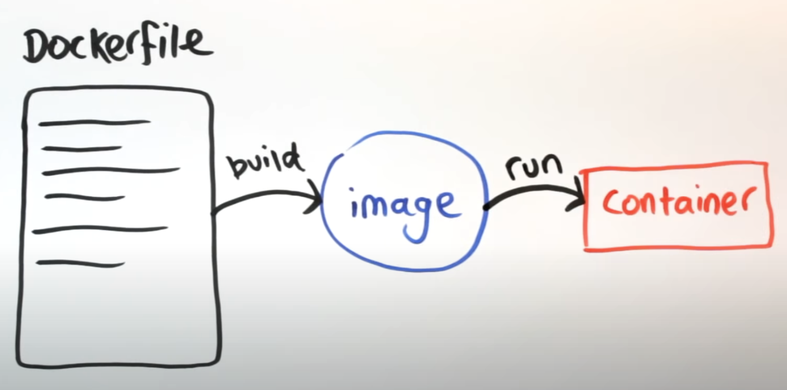

<script type="text/javascript" async
  src="https://cdnjs.cloudflare.com/ajax/libs/mathjax/2.7.7/MathJax.js?config=TeX-MML-AM_CHTML">
</script>

# Lesson 4 – Containerization with Docker
{:.no_toc}

All lectures will be delivered as readings that you complete on your own time. Post questions with the lesson [here](https://edstem.org/us/courses/28947/discussion/1970469).

Make sure to read this article and complete the **Action Item**{: .label .label-red }s before moving on to [Methodology Assignment 3](../../../assignments/methodology/q1/03).

A recording of the lecture help session associated with this lecture can be found [here](https://youtu.be/oeotJjaCJUI).

**Reminders:** 
- The [Quarter 1 Project Checkpoint](../../../assignments/projects/q1) is due on Sunday, October 30th.
- Take a look at the new [Resources](../../../resources) tab of the course website.


<!-- There is no Methodology Assignment associated with this lesson. However, there are a few "Action Items" and "Exercises" that you should complete while reading through the lesson, as they'll help you prepare for your Quarter 1 Project.

**Specifically, the  is due at the end of Week 5, on Sunday, October 30th. The report part of your checkpoint submission will consist of the [title, abstract](#title-and-abstract), and [introduction](#introduction) of your Quarter 1 Project.**

**Reminder:** Take a look at the new [Resources](../../../resources) tab of the course website. -->

---

## Table of contents
{: .no_toc .text-delta }

1. TOC
{:toc}

---

## Overview

At this point in your data science career, you've likely run into one of the following scenarios:

- A project ran fine on your computer, but not on your colleague's – it either produced incorrect results, or resulted in errors, like `ModuleNotFoundError: No module named 'numpy'`.
- When installing a package, you saw the message `Incompatible library version: requires version a.b.c or later, but you currently have version x.y.z`. When you fixed that, some other application broke.
- You needed to run your code on a more powerful server (say, AWS), but you weren't sure how to set up all the packages you needed on that server.

There are a few solutions to this problem:
- Python [virtual environments](https://docs.python.org/3/library/venv.html). A Python virtual environment is a combination of a Python version and libraries. Virtual environments are isolated, so when you "activate" one, the packages you install don't affect the packages installed on your system or in other virtual environments. Python virtual environments are lightweight, but, as the name suggests, only work with Python.
- Virtual machines. A virtual machine allows you to emulate another operating system on your own computer. Virtual machines are extremely customizable, as they essentially allow you to set up a new computer from scratch. However, they are very resource intensive.

The above solutions have their tradeoffs. The solution we will use, **Docker containers**, strike a happy medium. They work with languages other than Python, and are much more lightweight than virtual machines.

---

## Docker

<center></center>

### Overview

Watch the video below for a high-level primer on what Docker is.

<center><iframe width="711" height="400" src="https://www.youtube.com/embed/aLipr7tTuA4" title="YouTube video player" frameborder="0" allow="accelerometer; autoplay; clipboard-write; encrypted-media; gyroscope; picture-in-picture" allowfullscreen></iframe></center>

In short, Docker provides you with a **sandbox**, in which you can run applications and install packages without impacting other parts of your computer. Specifically:
- A Docker **image** is a snapshot of a development environment. An image contains everything you need to run an application – all dependencies, configuration, scripts, binaries, etc.
- A **container** is created using an image. Once you launch a container, you are in the aforementioned sandbox. Per the [Docker getting started guide](https://docs.docker.com/get-started/), "a container is simply another process on your machine that has been isolated from all other processes on the host machine."

Images and containers are closely related, but they're not the same thing. Here's an analogy: when Apple released iOS 16, they released an image. When you updated your iPhone to iOS 16 and started using it, you used Apple's iOS 16 image to launch a container. This is an imperfect analogy, because images are **not** the same thing as operating systems, but it should hopefully clarify how images and containers are different. Read [this article](https://www.howtogeek.com/devops/where-are-docker-images-containers-stored-on-the-host/) for more details.

While this may be the first time you've used Docker directly, it's not the first time you've used Docker. Each time you've used DataHub or run a launch script on DSMLP, you've indirectly specified a Docker image that you'd like to launch, and you've done your work inside a Docker container! For instance, [here](https://github.com/ucsd-ets/datahub-docker-stack/blob/main/images/scipy-ml-notebook/Dockerfile) is the **Dockerfile** that specifies the image that is used when you run `launch-scipy-ml.sh` on DSMLP. We'll learn more about Dockerfiles below, but for now, you'll note that the Dockerfile seems to be installing several Python packages for machine learning, like `torch` and `tensorflow-gpu`. Unsurprisingly, all large cloud compute providers (like AWS, GCP, and Azure) support containerized applications, and all support Docker.

Remember, Docker containers are **not** virtual machines, though they work similarly in some ways. Instead, they run processes using the host computer's kernel. It turns out that we can run multiple containers at a time on a single machine, each using the same or different images.

### Installing Docker Locally

**Action Item**{: .label .label-red } To complete Methodology Assignment 3, and more generally to create your own Docker images, you'll need to install [Docker Desktop](https://www.docker.com/products/docker-desktop/), a client for macOS, Windows, and Linux, locally on your computer. While DSMLP works with Docker, it does not have Docker Desktop installed.
- The video we had you watch earlier mentioned something called `boot2docker`. `boot2docker` is now deprecated and has been replaced with Docker Desktop. When you install Docker Desktop and pull an image, you essentially install the ability to run Linux-based applications, whether or not you have a Linux personal computer. Pretty cool, right!
- When you download and launch Docker Desktop, it'll prompt you to complete a tutorial. It's highly recommended that you do this!
- Installing Docker and pulling existing images requires having 5-10GB of free space on your computer. If you don't have this space available, you can request a [DigitalOcean Docker Droplet](https://marketplace.digitalocean.com/apps/docker), which will give you SSH access to a Linux VM with Docker installed. If you go this route, make sure to sign up for the [GitHub Student Developer Pack](https://education.github.com/pack) which gives you a $100 DigitalOcean credit. (You could use other Linux-based VMs, like AWS, too.)

### Using Images from Docker Hub

Often, you'll find yourself working with images that already exist for your project. Much like source code is stored on GitHub, Docker images are stored on [Docker Hub](https://hub.docker.com). At Docker Hub, you can browse through all publicly available Docker images. For instance, [here](https://hub.docker.com/r/ucsdets/datahub-base-notebook) is the base image that all other DataHub and DSMLP images are based off of. We'll build off of it in Methodology Assignment 3. Just like on GitHub, images can be public or private.

**Action Item**{: .label .label-red } Make a Docker Hub account. You'll need it, both for Methodology Assignment 3 and for your projects.

When launching a container on DSMLP, you can specify an image from Docker Hub that you'd like to launch your container in. For instance, suppose we want to launch a container using the [base data science image](https://hub.docker.com/r/ucsdets/datahub-base-notebook) linked above. To do so, we need to find the path for the image. Images on Docker Hub have paths of the form `<user>/<image>:<tag>`. For this image, the user is `ucsdets` and the image is `datahub-base-notebook`. To find the tag we want to use, we can click "Tags" to see a list. UCSD's Educational Technology Services (ETS) tends to tag release versions of its images with "stable", so upon searching for "stable", we see a list of relevant tags. `2022.3-stable` looks good. (You can see the stable releases of other images [here](https://github.com/ucsd-ets/datahub-docker-stack/wiki/Stable-Tag).)

<center></center>

(Read more about tags [here](https://www.freecodecamp.org/news/an-introduction-to-docker-tags-9b5395636c2a/).)

To launch a container on DSMLP with a specified image, we run

```
launch.sh -i <image_path>
```

So for the purposes of this example, we'll run

```
launch.sh -i ucsdets/datahub-base-notebook:2022.3-stable
```

Great! Upon launch, we'll be placed in a container whose environment is specified by the image we used. In the future, when you create your own images and upload them to Docker Hub, you'll launch servers on DSMLP with the path to your image, instead.

### Dockerfiles

Pre-existing images are great, but often you'll need to create your own image, customized for your project. Images are designed to be **layered**. That is, I can start with an existing layer and specify what I want to add on top of that layer (packages, languages, files, etc). The existing layer that I started with was itself likely layered upon other pre-existing images. If we continue up the hierarchy, the very first layer that our layer inherits from must have specified an operating system to use – we will exclusively work with Linux distributions; Ubuntu is quite common. (Note that you don't need a Linux computer to build a Linux image!)

How does one specify what components to include in an image? By writing a Dockerfile. A Dockerfile is a plain text file that contains a sequence of steps that one can use to recreate your development environment. To create an image, you build a Dockerfile. In keeping with the iOS 16 example from earlier, if Apple's release version of iOS 16 is an image and the copy of it running on my iPhone is a container, then the Dockerfile is the source code Apple wrote to create iOS 16.

<center><br>

(This diagram was taken from <a href="https://www.youtube.com/watch?v=YFl2mCHdv24&t=159s">another great video</a> about Docker.)
</center>

Let's look at a very basic example.

```
FROM ucsdets/datahub-base-notebook

USER root

RUN conda install --quiet --yes geopandas
```

Yes, this is an entire Dockerfile!

- The first line specifies that we want to start by adopting the `ucsdets/datahub-base-notebook` image that we looked at earlier. Everything that is part of `ucsdets/datahub-base-notebook` will be included in our new image, too.
- The next line specifies that we want to run all subsequent commands as the root (administrator) on the computer.
- The next line installs `geopandas` using `conda`. Note: this requires `conda` to be installed in the image. If it's not, this will error!

A similar-looking Dockerfile can be found [here](https://github.com/ucsd-ets/dsc10-notebook/blob/master/Dockerfile); it is the Dockerfile for the DSC 10 image on DataHub.

```
ARG BASE_CONTAINER=ucsdets/datascience-notebook:2022.3-stable
FROM $BASE_CONTAINER

USER root

RUN pip install coverage==5.5
RUN pip install 'pandas>=0.24' babypandas==0.1.7 pandas-tutor==2.0.3
RUN pip install otter-grader==3.3.0

USER $NB_UID
```

It's starting from a base image maintained by UCSD ETS (though not the same one as we looked at above), and installing the Python packages needed for DSC 10.

A more sophisticated Dockerfile might look like the following (taken from Aaron Fraenkel's malware domain):

```
FROM ucsdets/scipy-ml-notebook

USER root

RUN apt-get update && \
    apt-get upgrade -y && \
    apt-get install -y default-jre && \
    apt-get install -y default-jdk

ENV APK_SCRIPT https://raw.githubusercontent.com/iBotPeaches/Apktool/master/scripts/linux/apktool
ENV APK_JAR https://bitbucket.org/iBotPeaches/apktool/downloads/apktool_2.4.1.jar

RUN mkdir -p /usr/local/bin

RUN P=/tmp/$(basename $APK_SCRIPT) && \
    wget -q -O $P $APK_SCRIPT && \
    chmod +x $P && \
    mv $P /usr/local/bin

RUN P=/tmp/$(basename $APK_JAR) && \
    wget -q -O $P $APK_JAR && \
    chmod +x $P && \
    mv $P /usr/local/bin/apktool.jar
```

While this seems complicated, all it's doing is:
- Using `apt-get`, a package manager on Ubuntu, to install the default Java runtime environment and development kit
- Defining two environment variables
- Creating a path to place files in
- Downloading a few scripts from online and placing them in the specified path

While Dockerfiles can get quickly get complicated, note that you only need to specify what you want to include in your image on top of an existing image. You will almost always start by using one of the images pre-configured by UCSD ETS as a base image.

For a full reference of all the commands that Dockerfiles understand, look [here](https://docs.docker.com/develop/develop-images/dockerfile_best-practices/#dockerfile-instructions).

**Note:** Dockerfiles must be named `Dockerfile` with no extension. Otherwise, Docker Desktop won't recognize them when you try to build your image.

### Creating Images

Now that you know _what_ Dockerfiles do, you may be wondering _how_ to use them to create images and actually run code. [This tutorial](https://github.com/ucsd-ets/datahub-example-notebook), prepared by UCSD ETS (and, more specifically, a past methodology TA), walks through exactly how to do that.

In [Methodology Assignment 3](../../../assignments/methodology/q1/03), we will have you follow a subset of the instructions in the tutorial. Here's what we recommend:
- First, complete the tasks labeled **Action Item**{: .label .label-red } in this lesson.
- Then, skim through the instructions in the tutorial so that you know what is involved.
- Then, work through [Methodology Assignment 3](../../../assignments/methodology/q1/03), referring to the tutorial and this lecture as necessary.

**Note:** Under Step 2 of the tutorial, follow Option 1.

---

## Additional Resources

- [Docker and DSMLP tutorial](https://github.com/ucsd-ets/datahub-example-notebook)
- [Docker official getting started tutorial](https://docs.docker.com/get-started/)
- [Dockerfile instructions](https://docs.docker.com/develop/develop-images/dockerfile_best-practices/#dockerfile-instructions)
- [Launching containers on DataHub with Custom Images](https://support.ucsd.edu/its?id=kb_article_view&sys_kb_id=b18fd328dbe2dcd04cd8f06e0f961988)
- [How does Docker run Linux kernels on non-Linux machines?](https://stackoverflow.com/questions/43383276/how-does-docker-run-a-linux-kernel-under-macos-host)
  - [Read about how this was implemented by a Docker engineer.](https://news.ycombinator.com/item?id=11352594)
- [StackOverflow: What's the difference between Docker and Python virtualenv?](https://stackoverflow.com/questions/50974960/whats-the-difference-between-docker-and-python-virtualenv)

