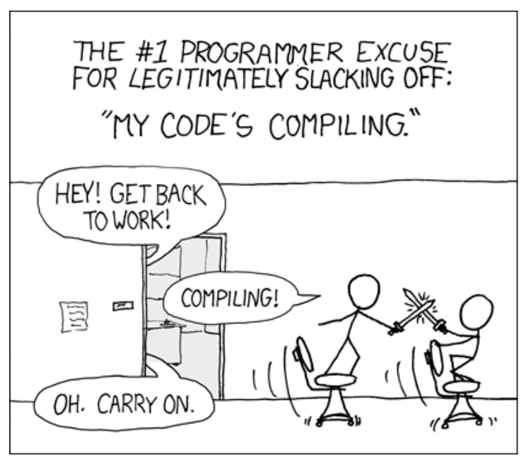
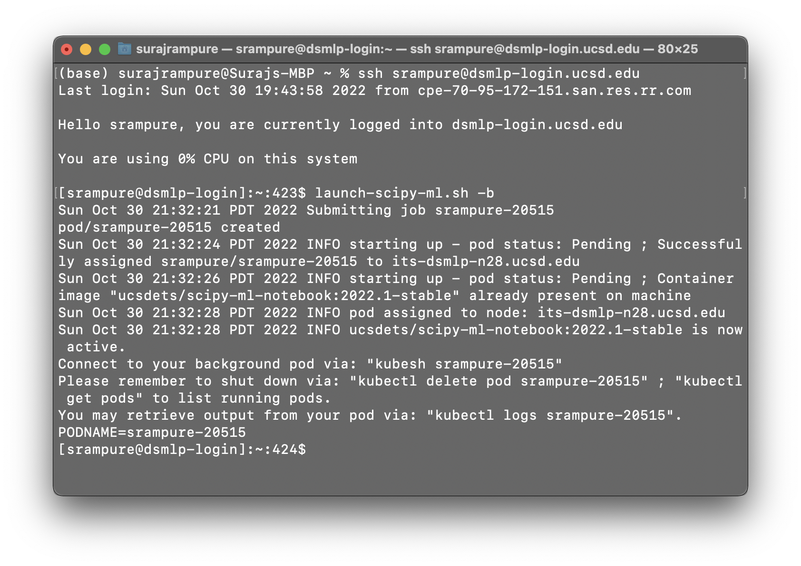

<script type="text/javascript" async
  src="https://cdnjs.cloudflare.com/ajax/libs/mathjax/2.7.7/MathJax.js?config=TeX-MML-AM_CHTML">
</script>

# Lesson 6 – Long-Running Jobs
{:.no_toc}

All lectures will be delivered as readings that you complete on your own time. Post questions with the lesson [here](https://edstem.org/us/courses/28947/discussion/2106318).

There is no Methodology Assignment associated with this lesson. However, the lesson describes some required aspects of the Quarter 1 Project code, such as [test data](#test-data).

---

## Table of contents
{: .no_toc .text-delta }

1. TOC
{:toc}

---

## Remote Job Submission

### Overview

Picture this: You're in a Jupyter Notebook, and hit `SHIFT+ENTER` to run a cell. That cell takes minutes, if not hours, to run. Since you can't do anything else in your notebook until the `[*]` symbol vanishes, you use this as an excuse to waste time on TikTok or Reddit. You've likely experienced this before – I know I have.

<center>



</center>

<center><i>In the traditional computing context, it was compiling that took a long time. In your case, it's likely model training. (<a href="https://xkcd.com/303/">source</a>)</i></center>

The reality is, **human time is worth a lot more than compute time**. While we can only work for so many hours a day, servers (like DSMLP) can run 24/7. Here, we'll learn how to initiate jobs that run for hours, or even days, on DSMLP. In order to do this, we need:

- A server that can run even after we log out. As we'll see, we can make DSMLP behave this way. Note that vanilla DataHub doesn't work this way – after 20 minutes of inactivity, DataHub disconnects you. 
- Code that doesn't require human interaction.
  - The job is going to run for minutes or hours without any intervention – we need to be able to run a single command, e.g. a **build script**, that runs our entire workflow.
- Code that is largely correct.
  - We don't want to wait hours before figuring out that our code is incorrect! As we'll see in the [Test Data](#test-data) section, there are best practices to follow here.
- Good logging.
  - Debugging is more difficult – the outputs of `print` statements won't be captured. In the [Logging](#logging) section, we'll discuss this further.


### DSMLP and Kubernetes

Over the last few weeks, we've learned how to launch servers on DSMLP with custom compute resources (amount of CPUs, GPUs, and RAM) and Docker images. It turns out that DSMLP is a _Kubernetes cluster_. [Kubernetes](https://kubernetes.io/docs/concepts/overview/) is a platform that manages, or _orchestrates_, containerized workloads. Recall from [Lesson 4](../04) that each server on DSMLP is a Docker container; Kubernetes is the system that manages which containers receive which resources on DSMLP.

_Fun fact: [Per the documentation](https://kubernetes.io/docs/concepts/overview/), Kubernetes is often shortened to "K8S" because there are 8 letters between the K and s in Kubernetes._

When we run a launch script on DSMLP, we are requesting a Kubernetes _pod_. While not entirely accurate, it's simplest to think of a pod as another term for a container (this is not fully accurate because pods can consist of multiple containers).

The reason this context is relevant is because we need to interact with the underlying Kubernetes infrastructure in order to initiate a long-running job in a pod. While on the DSMLP jumpbox server, there are two Kubernetes-related command-line tools to know about:
- `kubectl`, which stands for "Kubernetes control", allows us to list and delete pods associated with the current user. (Not sure how it's pronounced? [Neither are the enthusiasts.](https://www.youtube.com/watch?v=2wgAIvXpJqU))
- `kubesh`, which stands for "Kubernetes shell", allows us to connect to the shell (command-line) in a specified pod. 

**To launch a background pod – that is, a pod in which we will initiate a long-running job – we use the `-b` flag when running a launch script.** For instance, we may run `launch-scipy-ml -g 1 -c 4 -i srampure/lesson6:latest -b` to create a background-enabled pod with 1 GPU and 4 CPU cores, that has the Docker image `srampure/lesson6:latest` instantiated. When using the `-b` flag, notice that we are **not** put into the pod that we requested – instead, the pod is simply created.

<center></center>

<center><i>Note that the hostname is still <code>[srampure@dsmlp-login]</code>!</i></center>

The resulting output contains the pod ID – `srampure-20515` in this case – which we'll need to remember in order to interact with the pod. In order to actually enter the pod, we can run `kubesh <pod-id>`, e.g. `kubesh srampure-20515`.

Once we enter the pod, everything will appear as though we just ran our launch script without the `-b` flag. However, there's a difference – when we exit our pod (by either typing `exit` or hitting `CONTROL+D`), any processes we initiated will keep running!

### 🎥 Running Jobs on Background Pods

For a walkthrough on how to initiate long-running jobs, watch the following walkthrough video.

<div style="position: relative; padding-bottom: 56.25%; height: 0;"><iframe src="https://www.loom.com/embed/ee0651de02e14e50aa8b94e8e4455e90" frameborder="0" webkitallowfullscreen mozallowfullscreen allowfullscreen style="position: absolute; top: 0; left: 0; width: 100%; height: 100%;"></iframe></div>

As a summary:
- `kubesh <pod-id>` launches a pod.
- `kubectl get pods` lists all pods.
- `kubectl delete pod <pod-id>` deletes a pod.
- Adding the `&` after a call to `python` in the command-line, e.g. `python run.py test data &`, runs your Python process in the background without taking over the command prompt.
  - `ps` lists all of the current processes and their IDs.
  - `kill <process-id>` kills a process.

Note: The default timeout, according to the [DSMLP documentation](https://support.ucsd.edu/services?id=kb_article_view&sysparm_article=KB0032269&sys_kb_id=5bf581ba872299d4947a0fa8cebb35ea), is 6 hours (not 3, as mentioned in the video). If you need to need a pod to run for up to 12 hours, you can specify this by writing a custom launch script; see [here](https://support.ucsd.edu/services?id=kb_article_view&sysparm_article=KB0032273&sys_kb_id=b18fd328dbe2dcd04cd8f06e0f961988) for instructions on how to do so (you may also want to do this if you've gotten annoyed of writing out several flags each time you want to launch a pod). If you need a pod to run for more than 12 hours, contact datahub@ucsd.edu and mention that it's for DSC 180A.

Now that we know _how_ to initiate long-running jobs, let's look at best practices for doing so.

---

## Test Data

### Overview

It would be a massive waste of time and resources to kick off a long-running job that runs for a few hours before terminating because of a bug in our code. In order to detect such bugs, we will create and run our code on _test data_.

Test data is _small_, made-up data that is realistic enough to _test_ the behavior of our code.
- It is not a sample of real data – it should be _created_ by the developer.
- It is designed to test the correctness of code.
- Developers should design each line/component of the test data to test different aspects of their code.

**Warning**{: .label .label-yellow } **In this context, test data is created for unit tests, _not_ data that results from a train/test split!**

Test data should only be a few lines long. You should be able to verify that your code works correctly on test data **by hand**. For instance, suppose your code takes in a dataset, uses [`sklearn.preprocessing.PolynomialFeatures`](https://scikit-learn.org/stable/modules/generated/sklearn.preprocessing.PolynomialFeatures.html) to create a quadratic feature, and trains a regression model of the form $$H(x) = w_0 + w_1 x + w_2 x^2$$. A possible test dataset might be

```
x,y
-2,1
2,9
3,16
```
By hand, we can verify that the three points above satisfy $$y = (1 + x)^2 = 1 + 2x + x^2$$, so as a "test case" we can expect that our code outputs $$w_0 = 1, w_1 = 2, w_2 = 1$$ (with a loss of 0).

Note that since test data is synthetic, the resulting trained models will be meaningless. For instance, the weights $$w_0 = 1, w_1 = 2, w_2 = 1$$ mean nothing if our regression model aims to model car acceleration as a function of horsepower. This is expected – the sole purpose of test data is to ensure that code works correctly.

### Using Test Data

Run your project using test data until you can verify that your code and outputs are correct. Once you've done so, then you can initiate a long-running job on _real_ data, with the piece of mind that it should run correctly. (As an intermediate step you may also elect to run your code on a _sample_ of the full dataset, but remember, the test data is not merely a sample).

Recall, in [Lesson 5](../05#targets), we introduced the idea of _targets_. 

> A target specifies what to build. Specifically, a target is a string describing the desired output, and targets are used when calling build scripts from the Terminal.

You're **encouraged** to implement a `test-data` target, that runs the same code as the `data` target, but only on your test data. To train a model on your test data, you may run your build script with `test-data` as one of your many targets:

```py
python run.py test-data features model
```

For instance, the above call to `run.py` should featurize test data and use that featurized data to train a model.

While you're encouraged to implement a `test-data` target, you're **required** to implement a `test` target, both for your Quarter 1 Project and for your Quarter 2 Project. The `test` target should behave the same as the `all` target discussed in Lesson 5, just on your test data – that is, it should build your entire project from scratch, using test data.

We will use your `test` target to **grade** your project code in both quarters. Here are the specific commands we'll run on our personal DSMLP containers to grade your work:

1. `launch-scipy-ml.sh -i <your-docker-repo>`
2. `git clone <your-github-repo>`*
3. `python run.py test`
4. `<script that checks generated files>`

_*While your Quarter 2 Project repo is required to be public, your Quarter 1 Project repo can be private. As such, if your code is not accessible on GitHub, we'll download it directly from Gradescope._

This means that we (methodology staff) don't need access to your "real" data in order to evaluate your project. While your reports and deliverables will be a result of real data, your submitted code will not include it. As mentioned in Lesson 2, **your actual data should never included in Git/version control**, since it does not change. However, since test data is _created_ by the developer and may change as the project evolves, it **should** be included in version control. For instance, you may place it in the `test/testdata/` directory.

---

## Logging

When we initiate long-running jobs that run in the background, we don't typically have access to the command-line outputs (e.g. print statements) of our code. As such, it can be particularly difficult to debug when and why something went wrong. In this setting, the cost of trial-and-error is high, since each "trial" takes a long time to run.

The solution is to save logs to a file that you can inspect afterwards. The most rudimentary way to do this, if you're already using "print debugging", is to use the `>` keyword when calling `python` from the command-line. For instance,

```
python run.py all > log.txt &
```

will run `run.py` in the background (`&`), with the `test` target, and will save all outputs (e.g. results of print statements, warnings, and error messages) to `log.txt`. While this works, it can be difficult to determine where in the project each line in `log.txt` came from.

A better solution is to use the built-in [`logging`](https://docs.python.org/3/library/logging.html) module. It automatically records a timestamp each time it is called, along with which file and function the logging occurred in. You can customize the granularity and frequency of the logs to match your use case. We won't cover the details of the `logging` module here; instead, we'll point you to [this tutorial by realpython.com](https://realpython.com/python-logging/). However, here is an example of how the module works:

```python
# randdiv.py
import logging
import numpy as np

logging.basicConfig(filename='log.txt', 
		    filemode='a', 
		    level=logging.INFO,
		    datefmt='%H:%M:%S',
		    format='%(asctime)s,%(msecs)d %(name)s %(levelname)s %(message)s')

def myfunc():
    a = np.random.randint(-5, 5)
    b = np.random.randint(-5, 5)

    if b == 0:
        logging.info('zerodivisionerror preempted')

    else:
        return a / b

print([myfunc() for _ in range(100)])
```

Upon running `python randdiv.py`, `log.txt` might contain:

```
2022-10-30 23:37:11,815,815 root INFO zerodivisionerror preempted
```

This tells us when (October 30th at 11:37:11PM) and where (`randdiv.py`, the root-level file in this case) each call to `logging.info` occurred.