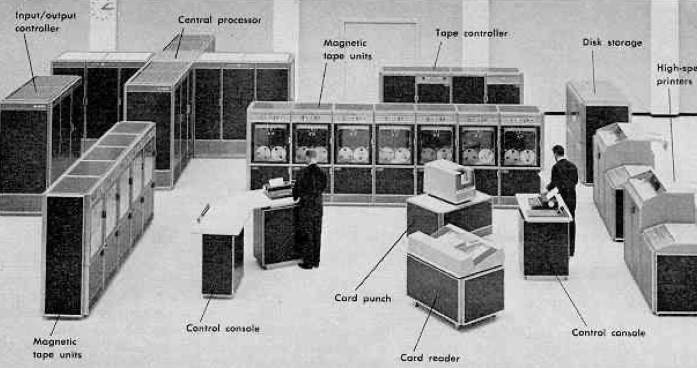
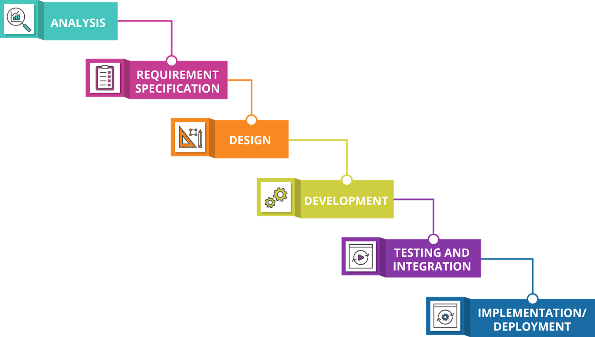

# Quarter 2, Lesson 1 – Project Management
{:.no_toc}

{: .note }
**Reminder**: Read the [Quarter 2 Syllabus](../../../../syllabus) and [Quarter 2 Project](../../../../assignments/projects/q2) specifications.

---

## Table of contents
{: .no_toc .text-delta }

1. TOC
{:toc}

---

## Overview

In Quarter 2, the methodology lessons are designed to aid you as you execute your Quarter 2 Project. While there are no methodology assignments, you can think of the later project checkpoints as being replacements for methodology assignments, in that you will apply what you learn in each lesson to a particular aspect of your project (e.g. you'll learn how to create a website on GitHub Pages, and then submit a website checkpoint for your project). 

Every single project deliverable, including your weekly [participation](../../../../assignments/participation/q2) assignments, must be submitted in groups. As the participation assignment mentions, you **must meet with your group members weekly outside of discussion**. In this lesson, we'll cover a few principles to follow, particularly in the context of developing software, so that you make the most of these weekly meetings and maximize your chances of successfully executing the proposal and schedule you developed at the end of Quarter 1. 

---

## Agile Software Development

**Agile** is a product management technique that we recommend you follow this quarter when executing your project. Before we discuss the details of Agile development (yes, [Agile is a proper noun in this context](https://www.scrum.org/resources/blog/agile-and-scrum-entwined-and-related)) and how you'll use it in your workflow, let's discuss how Agile came to be. 

### History of Software Development

Before the 1960s, software as we know it today didn't exist. At the time, computer programs were inseparable from the hardware they were written for. It was common for projects to be localized to a single computer, and as such, there was no need for programmers to think about how to organize their code so that others could use it.

Then, in the 1970s, hardware-agnostic programming languages – such as C – began to gain traction. This decoupling of software from hardware accelerated the growth of programming as a career, and the size of software projects dramatically increased.

This led to an interesting confluence – programmers were writing code that _could_, in theory, be run on others' computers, but since they hadn't been paying attention to the [robustness or organization of their code](https://en.wikipedia.org/wiki/Cowboy_coding), their code often _couldn't_ run on others' computers. Most code didn't work when shipped, which meant that programmers would have to spend time fixing someone else's code before they could get it to run on their own machine. Unfortunately, in some ways, data science [is still in this phase](https://twitter.com/emollick/status/1597733433765433344?s=20&t=8tR_rzjUe6nIPdwltz62-Q), which is why one the goals of the methodology portion of DSC 180A was to have you write and maintain your code in such a way that others could obtain and run your code without any additional setup.

One proposed strategy for managing the development of large group software projects was **waterfall development**, which is still in use today in some organizations. In waterfall development, _before_ work begins on a project, the team clearly states:
- What steps are required to execute the project.
- What needs to be completed in order to move from step N to step N + 1, for N = 1, 2, 3, ...

Then, the team works in on these steps in series – that is, the team finishes step 1, then once step 1 is finished, the team finishes step 2, and so on.

 (<a href="https://medium.com/@joneswaddell/the-cascading-costs-of-waterfall-5c3b1b8beaec">source</a>)

While this process can work in some settings, there are clear pitfalls:
- Not each team member has the same set of skills, and so often each will be assigned to a single step. This results in a lots of wasted time – what are your team members supposed to do while you're working on your step?
- If the project requirements change in, say, step 5, the entire process needs to be restarted.

### Agile Development

In 2001, a group of developers wrote the [_Manifesto for Agile Software Development_](https://agilemanifesto.org):

> We are uncovering better ways of developing
software by doing it and helping others do it.
Through this work we have come to value 

<b>Individuals and interactions</b> over processes and tools
  <b>Working software</b> over comprehensive documentation
  <b>Customer collaboration</b> over contract negotiation
  <b>Responding to change</b> over following a plan

  That is, while there is value in the items on
the right, we value the **items on the left** more.

Agile development is centered around having a working product (i.e. working code) at each stage of the project development process. This is in stark contrast to the waterfall method, in which the project only "works" at the very end. Agile development also emphasizes flexibility, which is **crucial** in data science projects. Plans change often, and by working incrementally and reflecting frequently (in your weekly meetings), you'll be able to quickly shift the trajectory of your project without wasting any time.

The following video does a good job of providing intuition for the difference between Agile and waterfall development.

<iframe width="560" height="315" src="https://www.youtube-nocookie.com/embed/QLvBK9stdoM" title="YouTube video player" frameborder="0" allow="accelerometer; autoplay; clipboard-write; encrypted-media; gyroscope; picture-in-picture; web-share" allowfullscreen></iframe>

### Agile Development in the Capstone

As mentioned earlier, you're encouraged to follow the principles of Agile development when working on your projects this quarter. Waterfall development will **not** work – there is simply no time for you to sit idle for weeks while your partners work. All group members need to be active each week.

When creating your schedule last quarter, you created a list of tasks that each group member will do each week. Now that you have more clarity on what the checkpoint deliverables are and when their deadlines are, you should modify your schedule such that each checkpoint deadline is accounted for.

You should plan your quarter in such a way that, every week:

- **Each group member can work in parallel.** That is, Person B should not have to wait for Person A to finish a task before they can start working. If Person B is working on a feature that depends on Person A's output, Person B can use test data (or something similar) as a placeholder for Person A's output until it is finalized. (For a concrete example, Person A may be writing scripts that clean raw data, and Person B may be building a machine learning model.)
- **Each group member is working on a different task than in the previous week.** It's totally fine if a particular task takes two weeks to complete, but the description of that task in your schedule should be different for both weeks, to reflect the breakdown of that task into smaller subtasks.
- **Each group member knows what everyone else is actively working on.** Not only will this held each group member accountable, but it'll also give other group members the opportunity to help resolve issues with tasks that weren't initially assigned to them.
- **The team, as a unit, produces code that is fully buildable and runnable.** All group members should regularly merge their code into the `main` branch of the repo, which will ensure that the `main` branch always contains a "complete" project.  It **should not** be the case that your group's codebase only runs in Week 7.  (Using the example from the embedded video above: your repo should always contain a fully-constructed house. The number of rooms and hallways of that house can change as the weeks go on, but it should always be a complete house.). We'll cover best practices for using Git and GitHub next week, but each week, all
- **The team, as a unit, decides what the plan for the next week is, and if any part of the existing schedule needs to change.**

To achieve all of these goals, it will be necessary to be in regular communication with your group, not just in section, but in your (required) separate weekly meetings and asynchronously.